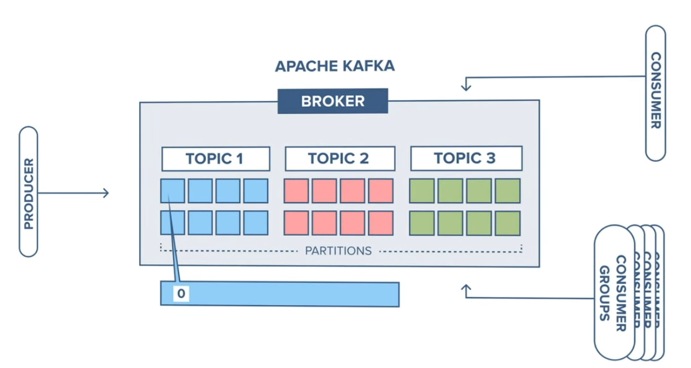
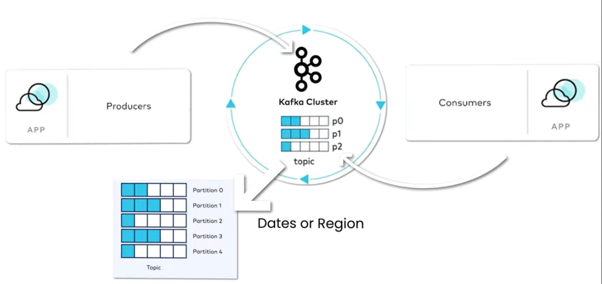
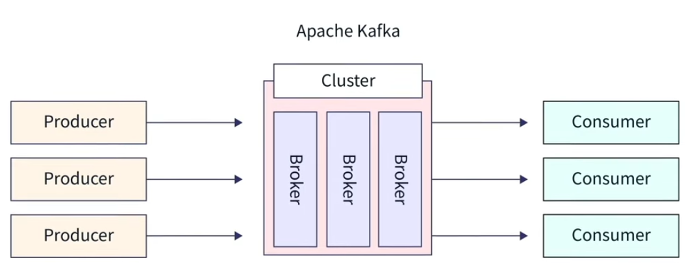
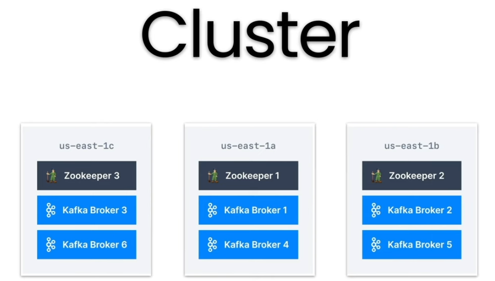
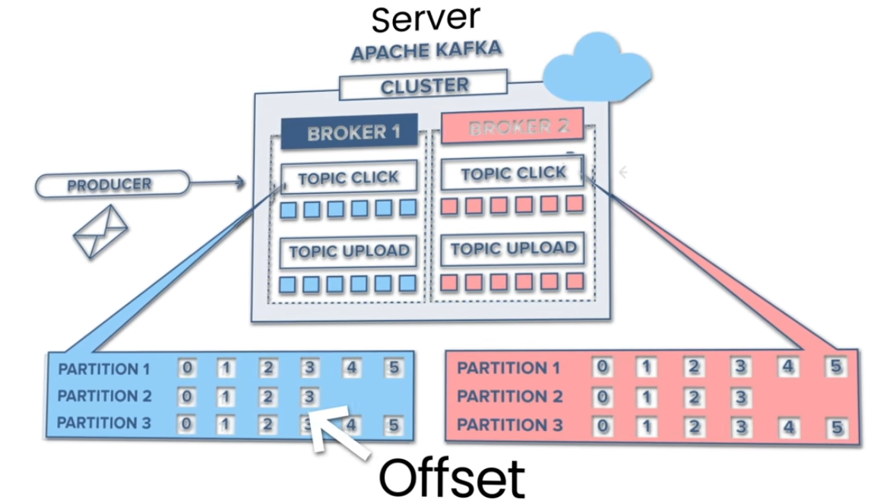

# Kafka Introduction

Real-Time Data Needs
- In today's world, real-time data streaming is essential for applications like food tracking and online shopping.
- Early 2000s saw low data generation speeds and volumes, but the rise of social media increased both.
- Businesses require immediate data insights to enhance customer service and detect issues, such as fraudulent transactions in real-time.
- Traditional batch processing methods (weekly/daily data processing) became insufficient for real-time requirements.

Challenges with Early Systems
- Early systems like RabbitMQ and transactional databases were effective for smaller applications but struggled with high data volumes.
- As data grew, these systems faced latency and bottlenecks, making it challenging to manage real-time demands.
- Maintaining these systems required significant time and effort, highlighting the need for more robust and scalable solutions.

Introduction of Apache Kafka
- Apache Kafka was created in 2010 by LinkedIn engineers to address the challenges of handling real-time data at scale.
- Designed as a distributed streaming platform, Kafka processes high-throughput and low-latency data streams.
- In 2011, LinkedIn open-sourced Kafka under the Apache Foundation, leading to widespread adoption across various industries.

Understanding Kafka Architecture
- Kafka consists of three main components: Producer, Consumer, and Broker.
- Producers push records into Kafka topics, generating data (e.g., actions on social media).
- Consumers retrieve and process this data, often used by data engineers for analysis.
- Data is organized into topics, which can be seen as categories. Topics can have partitions to manage data by regions or dates.



Topic Partitioning Strategy
- Topics can have multiple partitions to distribute data across the cluster by dates, regions, or other criteria.
- Each partition maintains order and immutability, ensuring data integrity.
- Partitioning enables parallel processing and scalability for large-scale data flows.



Kafka Brokers and Clusters
- A Kafka Broker stores data and serves client requests; multiple brokers form a cluster, ensuring high availability.
- Partitions within topics are ordered and immutable, meaning once data is stored, it cannot be modified.
- Each record is assigned a unique offset, allowing for precise tracking and processing of data.







## Hands-On Kafka Setup

### Step 1: Initial Setup with Docker

Before starting, ensure Docker is installed on your system:

```bash
docker --version
```

Start Kafka and Zookeeper using Docker Compose:

```bash
docker-compose up
```

Verify that containers are running:

```bash
docker ps
```

You should see Kafka and Zookeeper containers in the output.

---

## CLI-Based Approach: Using Terminal Commands

### Step 2: Access Kafka Container

Access the Kafka container shell:

```bash
# For standard shell:
docker exec -it <kafka_container_id> /bin/bash

# For Git Bash on Windows:
docker exec -it <kafka_container_id> bash
```

Replace `<kafka_container_id>` with the actual container ID from `docker ps`.

### Step 3: Navigate to Kafka Binaries

```bash
cd /opt/kafka/bin
```

### Step 4: Create a Topic

Create a topic named `test-topic` with 1 partition:

```bash
./kafka-topics.sh --create --topic test-topic --bootstrap-server localhost:9092 --replication-factor 1 --partitions 1
```

Create a topic with multiple partitions (3 partitions):

```bash
./kafka-topics.sh --create --topic test-topic-two --bootstrap-server localhost:9092 --replication-factor 1 --partitions 3
```

### Step 5: Produce Messages Using CLI

Run the Kafka producer in a terminal:

```bash
./kafka-console-producer.sh --topic test-topic --bootstrap-server localhost:9092
```

Type messages and press Enter to send them. For example:

```
Hello from Kafka
Qasim Hassan this side
First real-time message!
```

Press `Ctrl+C` to exit the producer.

### Step 6: Consume Messages Using CLI

Open a new terminal and run the Kafka consumer:

```bash
docker exec -it <kafka_container_id> /bin/bash
cd /opt/kafka/bin
./kafka-console-consumer.sh --topic test-topic --bootstrap-server localhost:9092 --from-beginning
```

The `--from-beginning` flag reads all messages from the start. You should see all messages produced earlier.

Press `Ctrl+C` to exit the consumer.

---

## Programmatic Approach: Using Python with Jupyter Notebooks

For a more programmatic approach, use the provided Jupyter notebooks to produce and consume messages using Python and the kafka-python library.

### Step 7: Using the Producer Notebook

Open `Producer.ipynb` and follow these steps:

1. **Cell 1 - Install Dependencies:**
   ```python
   !pip install kafka-python-ng
   ```

2. **Cell 2 - Import Libraries and Create Producer:**
   ```python
   from kafka import KafkaProducer, KafkaConsumer
   from kafka.errors import KafkaError
   import json

   # Define Kafka producer
   producer = KafkaProducer(
       bootstrap_servers=['localhost:9092'],
       value_serializer=lambda v: json.dumps(v).encode('utf-8')
   )
   ```

3. **Cell 3 - Produce Messages:**
   ```python
   # Produce messages to the topic
   for i in range(10):
       message = {'key': f'value-{i}', 'message': f'Message {i}'}
       future = producer.send('test-topic', value=message)
       try:
           record_metadata = future.get(timeout=10)
           print(f"Message {i} sent to topic={record_metadata.topic}, partition={record_metadata.partition}, offset={record_metadata.offset}")
       except Exception as e:
           print(f"Error sending message {i}: {e}")

   # Flush and close the producer
   producer.flush()
   producer.close()
   print("Producer closed successfully!")
   ```

The notebook will show the topic, partition, and offset for each message sent.

### Step 8: Using the Consumer Notebook

Open `Consumer.ipynb` and follow these steps:

1. **Cell 1 - Import Libraries:**
   ```python
   from kafka import KafkaConsumer
   import json
   ```

2. **Cell 2 - Create Consumer:**
   ```python
   # Define Kafka consumer
   consumer = KafkaConsumer(
       'test-topic',  # The topic to consume from
       bootstrap_servers=['localhost:9092'],
       auto_offset_reset='earliest',  # Read from the beginning
       enable_auto_commit=True,  # Automatically commit offsets
       value_deserializer=lambda x: x.decode('utf-8') if x else None
   )

   # Consume messages with error handling
   for message in consumer:
       print(message.value)
   ```

3. **Cell 3 - Consume with Partition and Offset Info:**
   ```python
   # Define Kafka consumer
   consumer = KafkaConsumer(
       'test-topic',
       bootstrap_servers=['localhost:9092'],
       auto_offset_reset='earliest',
       enable_auto_commit=True,
       value_deserializer=lambda x: x.decode('utf-8') if x else None
   )

   # Consume messages and print partition and offset
   count = 0
   for message in consumer:
       print(f"Consumed message: {message.value}")
       print(f"Partition: {message.partition}, Offset: {message.offset}")
       print("---")
       count += 1
       if count >= 10:  # Stop after consuming 10 messages
           break

   consumer.close()
   print("Consumer closed successfully!")
   ```

The notebook will display each message along with its partition and offset information.

---

## Comparison: CLI vs Programmatic Approach

| Aspect | CLI Commands | Python Notebooks |
|--------|--------------|------------------|
| Ease of Use | Simple, quick testing | More control and flexibility |
| Data Processing | Limited | Full Python ecosystem integration |
| Error Handling | Basic | Advanced error handling possible |
| Scalability | Manual management | Automated, scalable |
| Learning Curve | Low | Medium |
| Production Use | Not recommended | Recommended |

---

## Further Learning and Resources

- For more advanced understanding, explore projects like stock market data engineering that integrate Kafka with Python.
- The project is a good point to learn by doing, providing insights on setting up Kafka and coding applications from scratch.
- Experiment with different topic configurations (partitions, replication factors) to understand distributed data flow.
- Combine Kafka with data processing frameworks like Apache Spark for advanced real-time analytics.