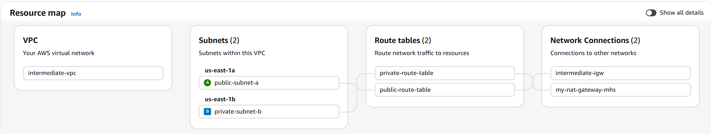
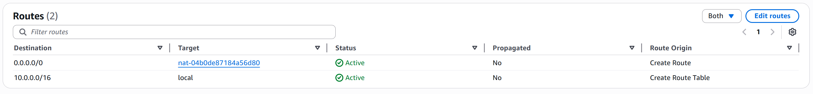

# VPC with NAT Gateway: Enabling Outbound Internet Access for Private Subnets 

## Overview
This guide teaches you how to set up a **NAT Gateway** so that your private subnet instances can initiate outbound internet connections (while still being hidden from inbound internet traffic).

---

## Architecture Diagram


## End Goal



## The Problem

**Scenario from before:**
```
Your database server in the private subnet needs to:
- Download security patches
- Install software packages
- Update system libraries
- Reach external APIs

But it has NO public IP and NO Internet Gateway route!
How can it reach the internet? 
```

**Solution: NAT Gateway**

---

## What is a NAT Gateway?

**NAT = Network Address Translation**

**In Simple Terms:**
A NAT Gateway is like a translator/proxy for your private instances.

```
Private Instance (10.0.1.5)
         ↓
    (Wants to reach Google.com)
         ↓
    NAT Gateway
    (Has public IP 54.201.123.100)
         ↓
    Translates request: 
    "10.0.1.5 wants to reach Google"
    to:
    "54.201.123.100 wants to reach Google"
         ↓
    Reaches Internet
         ↓
    Response comes back to NAT Gateway
         ↓
    Translates back: "Response for 10.0.1.5"
         ↓
    Delivers to Private Instance
```

**The Key Difference:**
- Private instance's IP (10.0.1.5) is NEVER exposed to the internet
- Only the NAT Gateway's public IP is visible to the internet
- Private instance can only INITIATE outbound connections (secure!)
- Internet cannot INITIATE connections TO the private instance

---

## Architecture You'll Build

```
Internet Users
     ↓
Internet Gateway
     ↓
VPC (10.0.0.0/16)
├── Public Subnet (10.0.1.0/24)
│   ├── NAT Gateway (+ Elastic IP)
│   └── Public EC2 (Web Server)
│
└── Private Subnet (10.0.2.0/24)
    └── Private EC2 (Database/App Server)
         ↓
    Uses NAT Gateway for outbound internet
```

---

## Prerequisites
- Completed "02-VPC-INTERMEDIATE-README.md"
- Understand public and private subnets
- About 30 minutes

---

## Step-by-Step Implementation

### STEP 1: Allocate an Elastic IP

**What is an Elastic IP?**
An Elastic IP is a static public IP address that you control. Unlike instance public IPs that change when you stop/start the instance, an Elastic IP remains the same.

**Why do we need it?**
The NAT Gateway needs a permanent public IP address.

**How to Allocate:**

1. Go to EC2 Dashboard
2. In the left sidebar, click "Elastic IPs"
3. Click "Allocate Elastic IP Address"
4. Fill in:
   ```
   Network Border Group: Your region (e.g., us-east-1)
   ```
5. Click "Allocate"
6. Note down the Elastic IP address (e.g., 54.201.123.100)
7. Elastic IP Allocated!

---

### STEP 2: Create NAT Gateway

**Important:** NAT Gateway MUST be in a PUBLIC subnet (so it can reach the internet)

**How to Create:**

1. Go to **VPC Dashboard**
2. In the left sidebar, click **"NAT Gateways"**
3. Click the **"Create NAT Gateway"** button
4. Fill in all the required fields:

#### **Name (Optional)**
```
Name:  my-nat-gateway-mhs
```
- This is a friendly name to identify your NAT Gateway
- Can be up to 256 characters long
- Recommended: Use a descriptive name like "my-nat-gateway-mhs" 

#### **Availability Mode (Required)**
```
  ○ Regional - new
⦿ Zonal  (RECOMMENDED for this guide)
```

**Zonal Mode (RECOMMENDED - Manual Subnet Selection):**
- You **CAN and SHOULD select a specific subnet** and availability zone
- Provides granular control within a specific AZ
- You have full control over NAT Gateway placement
- Best for: Learning, specific architectural needs, cost optimization, compliance
- **This is what we'll use** - simpler and more predictable
- When you choose this: Subnet field will appear below for you to select


#### **Subnet (Required for Zonal Mode - Your Selection)**
```

Select Subnet: public-subnet-a  (MUST be a PUBLIC subnet!)
               (or public-subnet-b, etc - whichever is PUBLIC)
```

**Important Notes:**
- Only appears when **Zonal** mode is selected
- Must be in a **PUBLIC subnet** (one with route to Internet Gateway)
- The NAT Gateway will be placed in this specific subnet
- Choose a subnet that has internet access
- If you're not sure which is public, check the route table - public subnets have a route to Internet Gateway
- For this guide, select whichever public subnet you created (e.g., public-subnet-a)

**How to Verify a Subnet is Public:**
1. Go to VPC → Subnets
2. Select the subnet
3. Go to Route Table tab
4. Check if there's a route to "Internet Gateway"
5. If yes → It's PUBLIC ✓
6. If no → It's PRIVATE ✗

#### **Connectivity Type (Required)**
```
⦿ Public  (RECOMMENDED)
  ○ Private
```

#### **Method of Elastic IP (EIP) Allocation (Required)**
```
we have already allocate the elastic ip in step 1 so we will use that, if you have not allocate the elastic ip in step 1 then click on allocate elastic ip
```


#### **Tags (Optional)**
```
Key:   Name
Value: my-nat-gateway-mhs

Key:   Environment
Value: production  (or development/staging)

Key:   Project
Value: vpc-project
```

**Why use tags?**
- Organize and track your AWS resources
- Filter resources by tags
- Manage costs and billing by project
- Enforce compliance and governance policies
- Limit to 50 tags maximum per resource

---

5. Click the **"Create NAT Gateway"** button at the bottom
6. **Wait for Status Change:**
   - New status appears: "Pending" (1-2 minutes)
   - Page automatically refreshes
   - Status changes to "Available" when ready
   - The NAT Gateway is now operational

7. **Verify Creation:**
   - Note down the NAT Gateway ID (e.g., `nat-0a1b2c3d4e5f6g7h8`)
   - Note down the Public IP address (Elastic IP)
   - Confirm status is "Available" 

 **NAT Gateway Successfully Created!**

---

### STEP 3: Update Private Route Table

Now we need to tell the private subnet: "When you want to reach the internet (0.0.0.0/0), send it through the NAT Gateway"

**How to Update:**

1. Go to "Route Tables"
2. Select "private-route-table" (from the intermediate guide)
3. Click the "Routes" tab
4. Click "Edit Routes"
5. Click "Add Route"
6. Fill in:
   ```
   Destination:    0.0.0.0/0
   Target:         NAT Gateway
   Select NAT:     my-nat-gateway
   ```

**What this rule means:**
```
"All traffic to the internet (0.0.0.0/0) should go through my-nat-gateway"
```

7. Click "Save Routes"
8. Route Table Updated!

---

### STEP 4: Verify Your Routing Configuration

**Private Route Table should now look like:**




**Public Route Table should still look like:**


Correct configuration!

---

### STEP 5: Setting Security Group and Launching Instances

we have already create the security group and launch the instance in previous guide. If you have those instances use them otherwise create it by reading the instruction from previous project guide.

---


### STEP 6: Connect to Web Server and Copy Database Key

`if you have complete the previous project then you don't have to copy the database-server ssh into web-server ssh.`

**Step 1: Copy the database key to the web server (from your local computer):**


Since you'll need to access the database server FROM the web server, copy the database key file to the web server:

`make sure that you change the ip address for below command according to your instance.`

```bash
# Copy kp-database-server.pem to web server's home directory
scp -i kp-web-server.pem kp-database-server.pem ec2-user@100.53.231.39:/home/ec2-user/
```

**Why?** The web server needs the database server's key to SSH into it from the private network.

**Step 2: Connect to the web server:**

Now SSH into the web server using the web server's key:

`make sure that you change the ip address for below command according to your instance.`

```bash
ssh -i kp-web-server.pem ec2-user@100.53.231.39
```

Once connected, you're now inside your web server instance!

---

### STEP 7: Access Database Server from Web Server

Now you're SSH-ed into the web server. From here, you can access the database server in the private subnet!

**From Web Server terminal, SSH to the database server:**

The database server is in the private subnet with private IP 10.0.2.47. Use the database key you just copied:

`make sure that you change the ip address for below command according to your instance.`

```bash
chmod 400 "kp-database-server.pem"
ssh -i ~/kp-database-server.pem ec2-user@10.0.2.47
```

You can now reach it! 

**Important: Key Separation Benefits**
- 🔒 Web server has its own key (kp-web-server.pem) - for your local access
- 🔒 Database server has its own key (kp-database-server.pem) - stored on web server only
- 🔒 If web server is compromised, database key is isolated
- 🔒 Better security than using the same key for both

**Why can the web server reach the database?**
- Both are in the same VPC (10.0.0.0/16)
- The security group rules allow it (web-sg can reach db-sg on port 22)
- Network routes allow local VPC traffic (both subnets are local routes)
- Database is HIDDEN from internet (no public IP)

---

### STEP 8: Verify Private Subnet Isolation

Now you're on the database server (10.0.2.47) in the private subnet!

**Verify it cannot reach the internet:**

```bash
ping -c 5 google.com
```

**Expected Output:**
```
PING google.com (142.251.179.139) 56(84) bytes of data.

--- google.com ping statistics ---
5 packets transmitted, 0 received, 100% packet loss, time 4134ms
```

**What This Means:** 
- ✅ DNS works (google.com → 142.251.179.139 resolved)
- ❌ Actual internet traffic is blocked (100% packet loss)
- ✅ This is secure and expected!

**Why?**
The private subnet's route table only has a local route (10.0.0.0/16 → local). There's no route to the internet (no NAT Gateway, no IGW), so packets destined for external IPs are dropped. The database server cannot initiate outbound connections to the internet, keeping it completely isolated and secure.

**Verify you can reach other servers in the VPC:**


```bash
ctrl + d
now you are in public subnet(ec2)
ping <enter private subnet(ec2) ip>  # Web server in the VPC
```

This should work! 

### STEP 9: Verify the NAT Gateway is Translating

Let's see what happens:

**From the private instance, check your source IP as seen by the internet:**

```bash
curl http://checkip.amazonaws.com
```

You'll see output like:
```
54.201.123.100
```

**This is important!**
- Your private instance's actual IP is 10.0.1.5
- But the internet sees the request coming from 54.201.123.100 (NAT Gateway's Elastic IP)
- This proves NAT translation is working! 

---


## Traffic Flow Breakdown

### 1. Incoming Traffic (User to Web Server)

```
User Request (from Internet)
    ↓
Internet Gateway
    ↓
Public Subnet
    ↓
Web Server (10.0.0.5)
```

### 2. Private Instance Outgoing Traffic

```
Private Instance (10.0.1.5)
    ↓ (wants to download patch from yum.amazonaws.com)
Private Route Table
    ↓ (matches 0.0.0.0/0 rule)
NAT Gateway (54.201.123.100)
    ↓ (translates: 10.0.1.5 → 54.201.123.100)
Internet Gateway
    ↓
Internet
```

### 3. Response Coming Back

```
Internet (yum.amazonaws.com)
    ↓ (sends response to 54.201.123.100)
Internet Gateway
    ↓
NAT Gateway
    ↓ (translates: 54.201.123.100 → 10.0.1.5)
Private Instance (10.0.1.5)
```

---

## Real-World Use Cases

**Use Case 1: Patching Servers in Private Subnet**

```bash
# On private instance:
sudo yum update -y  # Downloads latest security patches via NAT Gateway

# What happens:
# 1. EC2 sends: "10.0.1.5 needs yum packages"
# 2. NAT translates: "54.201.123.100 needs yum packages"
# 3. Amazon's yum repo responds to 54.201.123.100
# 4. NAT translates response back to 10.0.1.5
# 5. EC2 receives updates
```

**Use Case 2: Database Backups**

```bash
# Private database server needs to upload backups to S3:
aws s3 cp backup.sql s3://my-backup-bucket/

# What happens:
# 1. Private DB (10.0.1.5) initiates connection
# 2. NAT Gateway translates and forwards
# 3. S3 sees request from NAT Gateway public IP
# 4. Response comes back via NAT
# 5. Database receives confirmation
```

**Use Case 3: External API Calls**

```bash
# Private app server calls external weather API:
curl https://api.weather.com/forecast?city=NYC

# What happens:
# 1. Private app initiates HTTPS connection
# 2. NAT translates: 10.0.1.x → 54.201.123.100
# 3. weather.com responds to 54.201.123.100
# 4. NAT translates response back
# 5. App receives weather data
```

---

## Understanding NAT Gateway Costs

 **Important: NAT Gateways are NOT free!**

```
NAT Gateway Charges:
├── Per hour:          $0.045 per hour (~$32/month)
├── Data Processing:   $0.045 per GB
└── Total:             Approximately $45-100/month depending on usage
```

**Tips to Reduce Costs:**
1. Use NAT Gateways only when necessary
2. Consider NAT instances (t2.micro) for development (free tier)
3. Consolidate traffic through fewer NAT Gateways
4. Monitor data transfer volumes

---

## Troubleshooting

**Can't reach internet from private instance?**

1. Verify NAT Gateway status is "Available"
   - Go to VPC → NAT Gateways
   - Check status column

2. Verify route table has correct route:
   - Route Table should have: 0.0.0.0/0 → NAT Gateway
   - Not 0.0.0.0/0 → Internet Gateway

3. Check if route is actually pointing to the NAT Gateway:
   ```bash
   # From private instance:
   traceroute google.com
   # Should show NAT Gateway as first hop
   ```

4. Verify security group allows outbound traffic:
   - Security Group should not have restrictive outbound rules
   - Check outbound rules

**NAT Gateway creation failed?**

1. Verify Elastic IP is allocated
2. Verify NAT Gateway is placed in public subnet (not private)
3. Verify you have enough resources in your AWS account

**Can external systems now reach my private instance?**

No! The NAT Gateway is one-way:
- Private instance CAN initiate outbound connections
- But external systems CANNOT initiate inbound connections to private instance
- This is secure! 

---

## Testing Checklist

- [ ] Elastic IP allocated? 
- [ ] NAT Gateway created in public subnet? 
- [ ] NAT Gateway status is "Available"? 
- [ ] Private route table has 0.0.0.0/0 → NAT Gateway rule? 
- [ ] Can ping google.com from private instance? 
- [ ] Does `curl checkip.amazonaws.com` show NAT Gateway's Elastic IP? 
- [ ] Can external systems NOT reach private instance (ping times out)? 

---

## Key Concepts Summary

| Concept | Purpose | Location |
|---------|---------|----------|
| NAT Gateway | Enable outbound-only internet for private instances | Public Subnet |
| Elastic IP | Static public IP for NAT Gateway | Attached to NAT Gateway |
| Private Route | Route to NAT Gateway for outbound traffic | Private Route Table |
| Translation | Private IP ↔ Public IP translation | Automatic in NAT Gateway |
| Asymmetric Access | Out: Yes, In: No | By design (secure) |

---

## Next Steps

1. Explore **VPC Endpoints** to avoid NAT Gateway costs for AWS services
2. Set up multiple NAT Gateways for high availability
3. Implement NAT Gateway in multiple subnets
4. Monitor NAT Gateway metrics in CloudWatch

---

## Security Benefits

**Secure Outbound Access:**
- Private instances can access the internet
- No inbound connections from internet possible
- Great for security updates and patches

**Hidden Infrastructure:**
- Private instance IPs never exposed to internet
- Only NAT Gateway's IP visible externally

**Controlled Access:**
- Route table controls internet access
- You decide which subnets get internet access

---

## Cleanup: Delete Resources When Done

When finished, **delete all resources to avoid ongoing NAT Gateway charges** (the most expensive part!). Follow in this exact order.

### Step 1: Terminate EC2 Instances

1. Go to EC2 → Instances
2. Select all your instances (web-server, app-server, etc.)
3. Click "Instance State" → "Terminate Instance"
4. Confirm termination
5. Wait for all instances to reach "Terminated" state
6. Instances Terminated!

**Critical:** Must delete instances BEFORE deleting NAT Gateway!

---

### Step 2: Delete NAT Gateway

**NAT Gateway charges $0.045/hour even when idle!** Delete ASAP.

1. Go to VPC → "NAT Gateways"
2. Select "my-nat-gateway" (or your NAT GW name)
3. Click "Actions" → "Delete NAT Gateway"
4. Confirm deletion
5. Wait for status to change to "Deleted" (takes ~1 minute)
6. NAT Gateway Deleted!

**This stops the $32/month charge!**

---

### Step 3: Release Elastic IP

1. Go to EC2 → "Elastic IPs"
2. Select the Elastic IP you allocated for NAT
3. Click "Actions" → "Release Elastic IP Address"
4. Confirm
5. Elastic IP Released!

**Why:** Unattached Elastic IPs can charge $0.005/hour.

---

### Step 4: Delete Internet Gateway

1. Go to VPC → "Internet Gateways"
2. Select your IGW
3. Click "Actions" → "Detach from VPC"
4. Confirm
5. Select it again
6. Click "Actions" → "Delete Internet Gateway"
7. IGW Deleted!

---

### Step 5: Delete Route Tables

1. Go to VPC → "Route Tables"
2. Select public route table
3. Click "Actions" → "Delete Route Table"
4. Confirm
5. Select private route table
6. Click "Actions" → "Delete Route Table"
7. Confirm
8. Route Tables Deleted!

---

### Step 6: Delete Subnets

1. Go to VPC → "Subnets"
2. Select public subnet
3. Click "Actions" → "Delete Subnet"
4. Confirm
5. Select private subnet
6. Click "Actions" → "Delete Subnet"
7. Confirm
8. Subnets Deleted!

---

### Step 7: Delete VPC

1. Go to VPC → "VPCs"
2. Select your VPC
3. Click "Actions" → "Delete VPC"
4. Confirm
5. VPC Deleted!

---

### Step 8: Delete Security Groups (Optional)

1. Go to EC2 → "Security Groups"
2. Delete all custom security groups
3. Security Groups Deleted!

---

## Cleanup Checklist

- [ ] All EC2 instances terminated?
- [ ] NAT Gateway deleted?
- [ ] Elastic IP released?
- [ ] Internet Gateway detached and deleted?
- [ ] Route tables deleted?
- [ ] Subnets deleted?
- [ ] VPC deleted?
- [ ] Security groups deleted?

---

## Cost Impact of Cleanup

**Before Cleanup (Monthly Cost):**
```
NAT Gateway:        $32.00 (hourly charge)
Elastic IP:         $0.00 (attached, free)
EC2 t2.micro × 2:   $0.00 (free tier)
─────────────────
Total:              ~$32.00/month
```

**After Cleanup (Monthly Cost):**
```
All resources:      $0.00 
─────────────────
Total:              $0.00
```

**Monthly Savings: $32+** 

---

## NAT Gateway: The Most Important to Delete!

NAT Gateway charges even when:
- You're not using it
- Instances are stopped
- You're on vacation
- You forgot about it

**Action Items:**
1. Delete NAT Gateway first
2. Release Elastic IP
3. Then delete other resources

---

## Verify Deletion

Check that everything is gone:

```bash
# In AWS Console:
1. VPC → NAT Gateways: Should be EMPTY
2. EC2 → Elastic IPs: Should be EMPTY (or unattached)
3. VPC → VPCs: Should NOT see your VPC
4. EC2 → Instances: Should NOT see your instances
```

If all above are empty, you're good!

---

## If You Get Errors

**"Cannot delete NAT Gateway - has dependencies"**
- Verify all EC2 instances using it are terminated
- Delete route table entries pointing to NAT first
- Try again

**"Cannot delete VPC - has dependencies"**
- Verify NAT Gateway is deleted
- Verify IGW is detached
- Verify route tables are deleted
- Try again

**"Elastic IP still associated"**
- Make sure NAT Gateway is fully deleted
- Wait 1-2 minutes
- Then release the IP

---

## Budget Alert Setup (Recommended)

Before next use, set up AWS Billing Alerts:

1. Go to AWS Billing
2. Click "Budgets"
3. Create Budget → Monthly $5 limit
4. Get email alerts if over limit

This prevents surprise charges!

