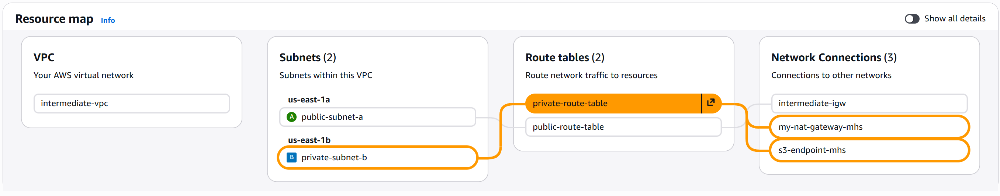
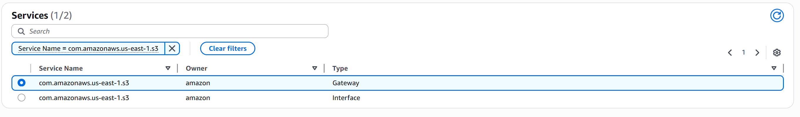

# VPC Endpoints: Private Access to AWS Services - Beginner's Guide

## Overview
This guide teaches you how to use **VPC Endpoints** to access AWS services (like S3) privately, without routing traffic through the Internet Gateway or NAT Gateway.


## Architecture Diagram


## End Goal



## The Problem

**Before VPC Endpoints:**

```
Private Instance wants to access S3:

Private Instance (10.0.1.5)
    ↓
NAT Gateway (costs money!)
    ↓
Internet Gateway
    ↓
Internet (data exposed)
    ↓
S3
    ↓ (returns data through internet gateway!)
Internet
    ↓
NAT Gateway
    ↓
Private Instance

Issues:
Expensive: NAT Gateway charges $0.045/GB for data transfer
Slow: Traffic goes through the internet (extra latency)
Exposed: Data briefly exposed to the internet
Vulnerable: More network hops = more security concerns
```

**With VPC Endpoints:**

```
Private Instance wants to access S3:

Private Instance (10.0.1.5)
    ↓
VPC Endpoint (direct connection!)
    ↓
S3 (within AWS network)
    ↓ (returns data directly!)
VPC Endpoint
    ↓
Private Instance

Benefits:
Free: No data transfer charges
Fast: Direct connection within AWS network
Secure: Never leaves AWS internal network
Simple: No NAT Gateway needed
```

---

## What is a VPC Endpoint?

**In Simple Terms:**
A VPC Endpoint is a private tunnel from your VPC directly to an AWS service, **without going through the internet**.

**Think of it like:**
- Instead of using the public highway (Internet) to reach Amazon's offices (S3)
- You use a private underground tunnel that's only for you
- Nobody on the public highway can see your traffic
- You don't pay tolls (no data transfer charges)

---

## Two Types of VPC Endpoints

### 1. Gateway Endpoints (Free)
- For S3 and DynamoDB
- No additional charges
- Added to route tables

### 2. Interface Endpoints (Small charge)
- For most other AWS services (EC2, SNS, etc.)
- Small hourly charge (~$0.007/hour per endpoint)
- Uses Elastic Network Interface (ENI)

**For this guide, we'll focus on Gateway Endpoints (S3 and DynamoDB) since they're free!**

---

## Architecture You'll Build

```
VPC (10.0.0.0/16)
├── Public Subnet (10.0.1.0/24)
│   ├── IGW (for internet)
│   └── Web Server
│
└── Private Subnet (10.0.2.0/24)
    ├── App Server
    └── Routes:
        ├── 0.0.0.0/0 → NAT Gateway (for other internet)
        └── s3.amazonaws.com → S3 Endpoint (for S3)
```

**Result:**
- App Server can read/write S3 privately (no NAT charges!)
- App Server can also download updates via NAT (if needed)
- All S3 traffic stays within AWS network

---

## Prerequisites
- Completed "03-VPC-NATGATEWAY-README.md"
- Private instance in private subnet
- About 30 minutes

---

## Step-by-Step Implementation

### STEP 1: Create IAM Role for EC2

**What is an IAM Role?**
An IAM Role is a set of permissions. We need to give our EC2 instance permission to access S3.

**How to Create:**

1. Go to IAM Dashboard
2. Click "Roles" in the left sidebar
3. Click "Create Role"
4. Select:
   ```
   Trusted Entity Type: AWS Service
   Service:           EC2
   ```
5. Click "Next"
6. Search for and select: "AmazonS3FullAccess"
   - (In production, you'd use more restrictive policies)
7. Click "Next"
8. Fill in:
   ```
   Role Name: EC2-S3-Access-Role
   ```
9. Click "Create Role"
10. IAM Role Created!

---

### STEP 2: Attach IAM Role to EC2 Instance

Your private instance needs this role so it can access S3.

**How to Attach:**

1. Go to EC2 Dashboard
2. Select your private instance (app-server)
3. Click "Actions" → "Security" → "Modify IAM Role"
4. Select:
   ```
   IAM Role: EC2-S3-Access-Role
   ```
5. Click "Update IAM Role"
6. IAM Role Attached!

---

### STEP 3: Create S3 Bucket (Optional - Use Existing)

If you already have an S3 bucket, skip this step. Otherwise:

**How to Create S3 Bucket:**

1. Search for "S3" in AWS
2. Click "Create Bucket"
3. Fill in:
   ```
   Bucket Name:  my-app-data-bucket-mhs
   Region:       us-east-1
   ```
   (Bucket names must be globally unique!)

4. Click "Create Bucket"
5. Note the bucket name
6. S3 Bucket Created!

---

### STEP 4: Create S3 Gateway Endpoint

This is the critical step! Creating the private tunnel to S3.

**How to Create:**

1. Go to VPC Dashboard
2. Click "Endpoints" in the left sidebar
3. Click "Create Endpoint"
4. Fill in:
   ```
   Name:              s3-endpoint
   Service Category:  AWS Services
   Services:          Search "s3"
   ```
   

5. Scroll down and fill in:
   ```
   VPC:                    intermediate-vpc
   Route Table:            private-route-table
   ```

**What this does:**
- Creates an endpoint for S3
- Automatically adds a route to this endpoint in your private route table
- Now traffic to S3 will go through this endpoint, not the NAT Gateway

6. Click "Create Endpoint"
7. Wait for status to change to "Available"
8. S3 Endpoint Created!

---

### STEP 5: Verify Endpoint Routing

Let's verify the route was created correctly:

**How to Check:**

1. Go to Route Tables
2. Select "private-route-table"
3. Click the "Routes" tab
4. You should now see:
   ```
   Destination              Target
   10.0.0.0/16             Local
   0.0.0.0/0               NAT Gateway
   s3.<region>.amazonaws.com   pl-xxxxx (S3 Endpoint)
   ```

**Perfect! The route table now knows:**
- "Local traffic (10.0.0.0/16) → stay local"
- "Internet traffic (0.0.0.0/0) → use NAT Gateway"
- "S3 traffic (s3.amazonaws.com) → use S3 Endpoint"

---

### STEP 6: Test S3 Access from Private Instance

Now for the fun part - testing that your private instance can reach S3 without using NAT!

**Step 1: SSH into private instance**

`make sure that you change the ip address for below command according to your instance.`

```bash
# From your local machine, SSH into web server first:
ssh -i kp-web-server.pem ec2-user@100.53.231.39

# From web server, SSH into database server:
ssh -i ~/kp-database-server.pem ec2-user@10.0.2.47
```

**Step 2: List S3 buckets**

```bash
# You're now on the private instance!
aws s3 ls

# You should see your bucket:
# 2024-01-15 10:30:00 my-app-data-bucket-mhs
```

**Success! Your private instance can access S3!**

---

### STEP 7: Upload File to S3

Let's test that you can actually read and write S3:

```bash
# Create a test file:
echo "Hello from private instance!" > test-file.txt

# Upload to S3:
aws s3 cp test-file.txt s3://my-app-data-bucket-mhs/

# List bucket contents:
aws s3 ls s3://my-app-data-bucket-mhs/
# Output: test-file.txt

# Download the file:
aws s3 cp s3://my-app-data-bucket-mhs/test-file.txt downloaded-file.txt

# View the file:
cat downloaded-file.txt
# Output: Hello from private instance!
```

**Perfect! Full S3 access from private instance!**

---

### STEP 8: Verify Traffic Stays Private

Let's verify this traffic is NOT going through the NAT Gateway (saving you money!):

**Check VPC Flow Logs (optional - advanced):**

1. Go to VPC Dashboard
2. Select your VPC
3. Click "Flow Logs" tab
4. Create a flow log if you don't have one:
   - Destination: CloudWatch Logs
   - Log group name: vpc-flow-logs
   - Role: Create new IAM role

5. Once logs are flowing, you'll see:
   - S3 traffic: Does NOT appear with NAT Gateway IP
   - NAT Gateway traffic: Appears for other internet traffic

**Simpler verification:**

Just check your NAT Gateway metrics in CloudWatch:
- If S3 endpoint is working, NAT Gateway data processing should NOT increase when accessing S3
- Only increases when accessing non-AWS services


## Traffic Flow Breakdown

### Scenario 1: App accesses S3

```
App Server (10.0.1.5) wants to read from S3:

1. App sends request: "Give me object.txt from bucket"
2. Route table checks destination: s3.amazonaws.com
3. Matches: s3.amazonaws.com → S3 Endpoint
4. Sends through S3 Endpoint
5. S3 processes request (within AWS network!)
6. Returns object.txt directly through endpoint
7. App receives file

Cost: FREE!
Route: Private Subnet → S3 Endpoint → S3 (all internal)
```

### Scenario 2: App downloads software package

```
App Server (10.0.1.5) wants to download from yum repo:

1. App sends request: "Give me apache.rpm from yum.amazonaws.com"
2. Route table checks destination: yum.amazonaws.com
3. Doesn't match S3 or DynamoDB endpoint
4. Matches: 0.0.0.0/0 → NAT Gateway
5. Sends through NAT Gateway
6. NAT translates: 10.0.1.5 → 54.123.456.789
7. Request goes to internet
8. yum.amazonaws.com responds
9. NAT translates response back
10. App receives package

Cost: $0.045/GB (data transfer charge)
Route: Private Subnet → NAT Gateway → Internet
```


## Cost Comparison

**Monthly Cost Example (1 TB data transfer from private subnet):**

| Traffic Type | Route | Cost |
|---|---|---|
| S3 via Endpoint | Endpoint (direct) | $0.00  |
| DynamoDB via Endpoint | Endpoint (direct) | $0.00  |
| Internet via NAT | NAT Gateway | $45.00 + $45.00 (1TB) = **$90.00** |

**Using VPC Endpoints saves you money!** 

---

## Real-World Use Cases

### Use Case 1: Data Lake in S3

```
Private Data Processing Cluster
    ↓
Reads millions of files from S3 (via S3 endpoint)
    ↓
Processes data
    ↓
Writes results back to S3 (via S3 endpoint)

Result:
 No NAT Gateway needed
 Saves thousands of dollars monthly
 Faster access (direct connection)
 More secure (private network)
```

### Use Case 2: Analytics Pipeline

```
Private EC2 instances
    ↓
Read data from DynamoDB (via DynamoDB endpoint) 
    ↓
Process with EMR (Elastic MapReduce)
    ↓
Write results to S3 (via S3 endpoint) 
    ↓
Query results from private instance

Cost Savings: $5,000+/month for large data transfers
```

### Use Case 3: Microservices with Secrets

```
Private microservice
    ↓
Needs to retrieve database password
    ↓
Calls Secrets Manager via endpoint 
     No NAT Gateway usage
     Direct private connection
     Instant access
```

---

## Endpoint Policy (Security)

By default, endpoints allow access to everyone. You can restrict this:

**Example: Allow only specific bucket**

1. Go to VPC → Endpoints
2. Select your S3 endpoint
3. Click "Edit Policy"
4. Change to:
```json
{
    "Version": "2012-10-17",
    "Statement": [
        {
            "Principal": "*",
            "Action": "s3:*",
            "Effect": "Allow",
            "Resource": [
                "arn:aws:s3:::my-app-data-bucket-12345",
                "arn:aws:s3:::my-app-data-bucket-12345/*"
            ]
        }
    ]
}
```

Now only your specific bucket can be accessed!

---

## Troubleshooting

**Can't access S3 from private instance?**

1. Verify IAM role is attached to EC2 instance
   - Go to EC2 instance details
   - Check "IAM Role" field

2. Verify S3 endpoint exists and is "Available"
   - Go to VPC → Endpoints
   - Check status

3. Verify route table has endpoint route
   - Route Table → Routes
   - Should show: s3.*.amazonaws.com → pl-xxxxx

4. Test manually:
   ```bash
   aws s3 ls --region us-east-1
   ```

5. Check CloudTrail for errors (advanced)
   - CloudTrail logs all API calls

**Endpoint creation failed?**

1. Verify S3 service is available in your region
2. Verify VPC and route table IDs are correct
3. Check you have enough network resources

**Still using NAT Gateway for S3?**

1. Verify endpoint route has higher priority
2. Check if you're using a different region
   - S3 endpoint should match your region
   - e.g., s3.us-east-1.amazonaws.com

---

## Testing Checklist

- [ ] IAM role created? 
- [ ] IAM role attached to EC2? 
- [ ] S3 endpoint created? 
- [ ] S3 endpoint status is "Available"? 
- [ ] Private route table has S3 endpoint route? 
- [ ] Can list S3 buckets from private instance? 
- [ ] Can upload file to S3? 
- [ ] Can download file from S3? 
- [ ] NAT Gateway NOT used for S3 traffic? 
---

## Key Concepts

| Concept | Purpose | Cost |
|---------|---------|------|
| Gateway Endpoint | Direct tunnel to S3/DynamoDB | FREE |
| Interface Endpoint | Direct tunnel to other AWS services | $0.007/hr |
| Endpoint Policy | Security control for endpoint | FREE |
| Route Priority | Determines which route to use | - |

---

## Summary

**Before VPC Endpoints:**
- Private instances need NAT Gateway to access S3
- Costs: $0.045/GB data transfer
- Traffic exposed to internet
- Extra latency

**With VPC Endpoints:**
- Private instances access S3 directly
- Costs: FREE for S3/DynamoDB
- Traffic stays in AWS network
- Lower latency
- More secure

---

## Next Steps

1. Implement both S3 and DynamoDB endpoints
2. Create restrictive endpoint policies
3. Monitor endpoint traffic in CloudWatch
4. Implement Interface Endpoints for other AWS services
5. Set up VPC endpoint service for your own applications

---

## Cleanup: Delete Resources When Done

When you're finished experimenting, delete resources to avoid charges. VPC Endpoints are cheap, but clean up anyway for good practice.

### Step 1: Terminate EC2 Instances

1. Go to EC2 → Instances
2. Select your app-server instance
3. Click "Instance State" → "Terminate Instance"
4. Confirm
5. Wait for termination
6. Instance Terminated!

**Must delete instances BEFORE VPC!**

---

### Step 2: Delete VPC Endpoints

1. Go to VPC → "Endpoints"
2. Select "s3-endpoint"
3. Click "Actions" → "Delete Endpoints"
4. Confirm
5. Select "dynamodb-endpoint" (if created)
6. Click "Actions" → "Delete Endpoints"
7. Confirm
8. Endpoints Deleted!

---

### Step 3: Delete S3 Bucket (If Created)

1. Go to S3
2. Select "my-app-data-bucket-xxxxx"
3. Click "Empty Bucket"
4. Type bucket name to confirm
5. Click "Empty"
6. Select bucket again
7. Click "Delete Bucket"
8. Type bucket name to confirm
9. Click "Delete Bucket"
10. S3 Bucket Deleted!

 **Important:** S3 buckets must be empty before deletion!

---

### Step 4: Delete NAT Gateway (If Using One)

If you followed earlier guides with NAT:

1. Go to VPC → "NAT Gateways"
2. Select your NAT Gateway
3. Click "Actions" → "Delete NAT Gateway"
4. Confirm
5. Wait for deletion
6. NAT Gateway Deleted!

---

### Step 5: Release Elastic IP (If Using One)

If you allocated an Elastic IP:

1. Go to EC2 → "Elastic IPs"
2. Select your Elastic IP
3. Click "Actions" → "Release Elastic IP Address"
4. Confirm
5. Elastic IP Released!

---

### Step 6: Delete Internet Gateway

1. Go to VPC → "Internet Gateways"
2. Select your IGW
3. Click "Actions" → "Detach from VPC"
4. Confirm
5. Select it again
6. Click "Actions" → "Delete Internet Gateway"
7. IGW Deleted!

---

### Step 7: Delete Route Tables

1. Go to VPC → "Route Tables"
2. Delete all custom route tables (NOT the main one)
3. Route Tables Deleted!

---

### Step 8: Delete Subnets

1. Go to VPC → "Subnets"
2. Delete your subnets
3. Subnets Deleted!

---

### Step 9: Delete VPC

1. Go to VPC → "VPCs"
2. Select your VPC
3. Click "Actions" → "Delete VPC"
4. Confirm (deletes remaining resources automatically)
5. VPC Deleted!

---

### Step 10: Delete Security Groups & IAM Role (Optional)

**Delete Security Groups:**
1. Go to EC2 → "Security Groups"
2. Delete your custom security groups

**Delete IAM Role:**
1. Go to IAM → "Roles"
2. Select "EC2-S3-Access-Role"
3. Click "Delete Role"
4. Confirm
5. Role Deleted!

---

## Cleanup Checklist

- [ ] EC2 instance terminated?
- [ ] S3 Endpoint deleted?
- [ ] DynamoDB Endpoint deleted?
- [ ] S3 bucket emptied and deleted?
- [ ] NAT Gateway deleted (if used)?
- [ ] Elastic IP released (if used)?
- [ ] IGW deleted?
- [ ] Route tables deleted?
- [ ] Subnets deleted?
- [ ] VPC deleted?
- [ ] Security groups deleted (optional)?
- [ ] IAM role deleted (optional)?

---

## Cost Summary

**If completed within 1 month:**

```
AWS Service              Cost
───────────────────────────
VPC                      FREE
Subnets                  FREE
Route Tables             FREE
IG W                     FREE
Security Groups          FREE
VPC Endpoints (S3)       FREE
VPC Endpoints (DDB)      FREE
EC2 t2.micro             FREE (12 months)
S3 Storage (if bucket)   Variable
────────────────────────────
Total:                   FREE-$2.00
```

VPC Endpoints are one of the cheapest AWS features!

---

## VPC Endpoints Cost

**Gateway Endpoints (S3, DynamoDB):**
```
Hourly charge:     FREE 
Data transfer:     FREE 
Monthly cost:      $0.00
```

**Interface Endpoints (other services):**
```
Hourly charge:     $0.007/hour = ~$5/month
Data transfer:     $0.01/GB
```

Gateway Endpoints are ALWAYS free!

---

## Verify Everything Deleted

To confirm complete cleanup:

```bash
1. VPC Dashboard → VPCs: Your VPC gone? ✓
2. VPC Dashboard → Subnets: Your subnets gone? ✓
3. VPC Dashboard → Endpoints: Your endpoints gone? ✓
4. VPC Dashboard → Internet Gateways: Your IGW gone? ✓
5. VPC Dashboard → Route Tables: Your tables gone? ✓
6. VPC Dashboard → NAT Gateways: Your NAT gone? ✓
7. EC2 → Instances: Your instances gone? ✓
8. EC2 → Elastic IPs: Your IPs released? ✓
9. EC2 → Security Groups: Your SGs gone? ✓
10. S3: Your buckets gone? ✓
```

If all check marks ✓, you're completely cleaned up!

---

## Troubleshooting Deletions

**Cannot delete S3 bucket:**
- Bucket must be empty
- Delete all objects first
- Delete all versions
- Then delete bucket

**Cannot delete VPC:**
- All instances must be terminated
- All ENIs must be deleted
- All route tables must be deleted
- All subnets must be deleted

**Cannot delete Endpoint:**
- Remove from route tables first
- Then delete endpoint

**Cannot delete Security Group:**
- Used by running instances
- Terminate instances first
- Then delete SG