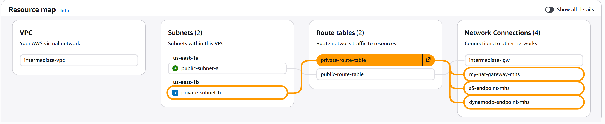
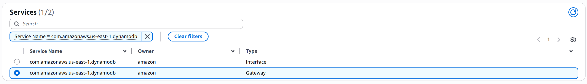
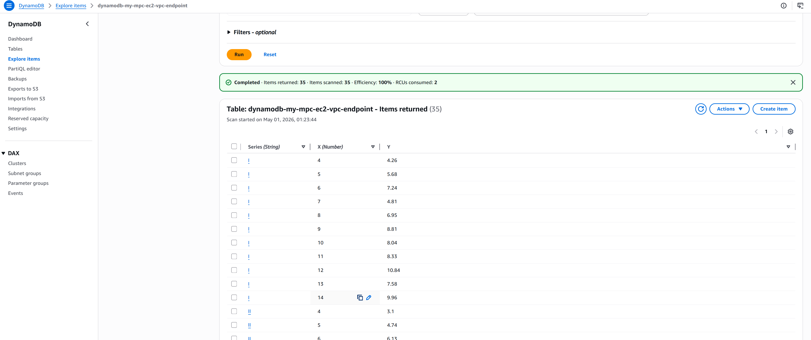

# Advanced VPC: Complete Production Architecture with NAT Gateways and Endpoints - Beginner's Guide

## Overview
This comprehensive guide brings together everything you've learned and shows you how to build a **production-grade VPC architecture** combining NAT Gateways, VPC Endpoints, and multiple subnets.

---

## Architecture Diagram


## End Goal



## What You're Building

This is the **most advanced and realistic** VPC setup you'll encounter:

```
Internet Users
       ↓
   IGW
       ↓
VPC (10.0.0.0/16)
├── Public Subnet (10.0.1.0/24) [us-east-1a]
│   ├── NAT Gateway (54.201.123.100)
│   ├── Elastic IP
│   └── Web Server
│
├── Private Subnet (10.0.2.0/24) [us-east-1b]
│   ├── database Server
│   ├── Route: 0.0.0.0/0 → NAT Gateway
│   ├── Route: s3.* → S3 Endpoint
│   └── Route: dynamodb.* → DynamoDB Endpoint

```

---

## Why This Architecture?

```
High Availability:
   - Multiple subnets in different AZs
   - If one data center fails, others work

Security:
   - Public web tier isolated from private app tier
   - App tier isolated from database tier
   - Databases completely hidden from internet

Cost Efficiency:
   - VPC Endpoints avoid NAT charges for AWS services
   - Shared NAT Gateway for multiple instances

Scalability:
   - Easy to add more instances
   - Load balancing ready
   - Auto-scaling capable
```


## Prerequisites

- Completed all previous guides (01-04)
- Understanding of public/private subnets
- Understanding of NAT Gateways
- Understanding of VPC Endpoints
- About 90 minutes

---

## Step-by-Step Implementation


### STEP 1: Update IAM Role for EC2

1. Go to IAM Dashboard
2. search role "EC2-S3-Access-Role-mhs"
3. Click on that role
4. select permission tab
5. Click on (Add permission) button and then attach policy 
6. Search dynamodb and select (AmazonDynamoDBFullAccess)
7. Click Add permission
8. IAM Role Updated!

---

### STEP 2: Launch EC2 Instances

use the previous ec2, web-server and database-server

### STEP 3: Create VPC Endpoints

**Create DynamoDB Endpoint:**

1. Click "Create Endpoint"
2. Fill in:
   ```
   Name:         dynamodb-my-mpc-ec2-vpc-endpoint
   Search:       dynamodb
   VPC:          intermediate-vpc
   Route Tables: Select private-route-table
   ```
3. Click "Create Endpoint"
4. DynamoDB Endpoint Created!



## Testing Both S3 and Dynamodb Endpoint:

### STEP 1: Test S3 Access from Private Instance

Now for the fun part - testing that your private instance can reach S3 without using NAT!

**Step 1: SSH into private instance**

`make sure that you change the ip address for below command according to your instance.`

```bash
# From your local machine, SSH into web server first:
ssh -i kp-web-server.pem ec2-user@100.53.231.39

# From web server, SSH into database server:
ssh -i ~/kp-database-server.pem ec2-user@10.0.2.47
```

**Step 2: List S3 buckets**

```bash
# You're now on the private instance!
aws s3 ls

# You should see your bucket:
# 2024-01-15 10:30:00 my-app-data-bucket-mhs
```

**Success! Your private instance can access S3!**

---

### STEP 2: Upload File to S3

Let's test that you can actually read and write S3:

```bash
# Create a test file:
echo "Hello from private instance!" > test-file.txt

# Upload to S3:
aws s3 cp test-file.txt s3://my-app-data-bucket-mhs/

# List bucket contents:
aws s3 ls s3://my-app-data-bucket-mhs/
# Output: test-file.txt

# Download the file:
aws s3 cp s3://my-app-data-bucket-mhs/test-file.txt downloaded-file.txt

# View the file:
cat downloaded-file.txt
# Output: Hello from private instance!
```

**Perfect! Full S3 access from private instance!**

---

### STEP 3: Test dynamo db Access from Private Instance

```bash

# List Dynamodb tables
aws dynamodb list-tables

# make a file for storing data in private(Ec2)

sudo nano data-vpc-dynamodb.json

# make a file for storing code in private(Ec2)
sudo nano vpc-dynamodb.py

# install dependencies
sudo dnf install python3-pip -y
pip3 --version
pip3 install boto3

# now run the code in vpc-dynamodb.py
python3 vpc-dynamodb.py

# after that you will see the data inside table 

```



## Monitoring Checklist

```
CloudWatch Metrics to Monitor:

NAT Gateway:
├── Bytes Sent/Received
├── Connection Count
├── Error Port Allocation
└── Data Processing

VPC Flow Logs:
├── Accepted connections
├── Rejected connections
└── Traffic patterns

EC2 Instances:
├── CPU Utilization
├── Network In/Out
├── Disk I/O
└── Status Checks
```

## Cleanup: Delete Resources When Done

When you're finished with the production architecture, **delete all resources to stop charges**. This is critical because NAT Gateways are expensive!

### Step 1: Terminate All EC2 Instances

1. Go to EC2 → Instances
2. Select ALL your instances:
   - web-server-prod
   - db-server-prod
3. Click "Instance State" → "Terminate Instance"
4. Confirm termination
5. Wait for all to reach "Terminated" state
6. All Instances Terminated!

**Critical:** Instances must be terminated FIRST!

---

### Step 2: Delete NAT Gateway (PRIORITY!)

**NAT Gateway charges $32/month even when idle!**

1. Go to VPC → "NAT Gateways"
2. Select "production-nat-gw"
3. Click "Actions" → "Delete NAT Gateway"
4. Confirm
5. Wait for status to change to "Deleted"
6. NAT Gateway Deleted!

**This stops the most expensive charge!**

---

### Step 3: Release Elastic IP

1. Go to EC2 → "Elastic IPs"
2. Select your Elastic IP (54.xxx.xxx.xxx)
3. Click "Actions" → "Release Elastic IP Address"
4. Confirm
5. Elastic IP Released!

**Why:** Unassociated Elastic IPs charge $0.005/hour (~$3.60/month).

---

### Step 4: Delete VPC Endpoints

1. Go to VPC → "Endpoints"
2. Select "s3-endpoint"
3. Click "Actions" → "Delete Endpoints"
4. Confirm
5. Select "dynamodb-endpoint"
6. Click "Actions" → "Delete Endpoints"
7. Confirm
8. Endpoints Deleted!

---

### Step 5: Delete Internet Gateway

1. Go to VPC → "Internet Gateways"
2. Select "production-igw"
3. Click "Actions" → "Detach from VPC"
4. Confirm
5. Select it again
6. Click "Actions" → "Delete Internet Gateway"
7. IGW Deleted!

---

### Step 6: Delete Route Tables

1. Go to VPC → "Route Tables"
2. Delete all custom route tables:
   - public-route-table
   - private-route-table-b
   - private-route-table-c
3. Route Tables Deleted!

**Don't delete the main route table!**

---

### Step 7: Delete Subnets

1. Go to VPC → "Subnets"
2. Delete all subnets:
   - public-subnet-a
   - private-subnet-b
   - private-subnet-c
3. Subnets Deleted!

---

### Step 8: Delete VPC

1. Go to VPC → "VPCs"
2. Select "production-vpc"
3. Click "Actions" → "Delete VPC"
4. Confirm (deletes any remaining resources)
5. VPC Deleted!

---

### Step 9: Delete S3 Bucket (If Created)

1. Go to S3
2. Select "production-data-bucket-xxxxx"
3. Click "Empty Bucket"
4. Type bucket name and confirm
5. Once empty, select bucket
6. Click "Delete Bucket"
7. Type bucket name and confirm
8. S3 Bucket Deleted!

---

### Step 10: Delete Security Groups (Optional)

1. Go to EC2 → "Security Groups"
2. Delete:
   - web-sg
   - app-sg
   - db-sg
3. Security Groups Deleted!

---

### Step 11: Delete IAM Role (Optional)

1. Go to IAM → "Roles"
2. Select "production-ec2-role"
3. Click "Delete Role"
4. Confirm
5. Role Deleted!

---

## Cleanup Checklist

```
[ ] All 3 EC2 instances terminated?
[ ] NAT Gateway deleted?
[ ] Elastic IP released?
[ ] S3 Endpoint deleted?
[ ] DynamoDB Endpoint deleted?
[ ] Internet Gateway detached and deleted?
[ ] All route tables deleted (except main)?
[ ] All subnets deleted?
[ ] VPC deleted?
[ ] S3 bucket emptied and deleted (optional)?
[ ] Security groups deleted (optional)?
[ ] IAM role deleted (optional)?
```

Check all boxes = Complete cleanup!

---

## Estimated Cost Cleanup Impact

**Before Cleanup (Monthly Cost):**

```
AWS Service              Cost/Month
─────────────────────────────────────
NAT Gateway              $32.00
Elastic IP (unassoc.)    $3.60 (if released late)
EC2 t2.micro × 3         $0.00 (free tier)
VPC Components           $0.00
VPC Endpoints            $0.00
S3 Storage (100 GB)      ~$2.30
─────────────────────────────────────
Total                    ~$37.90/month
```

**After Cleanup (Monthly Cost):**

```
AWS Service              Cost/Month
─────────────────────────────────────
All Components           $0.00 
─────────────────────────────────────
Total                    $0.00
```

**Monthly Savings: ~$37.90** 

---

## The Most Expensive Components

In order of cost:

1. **NAT Gateway** - $32/month (ALWAYS delete this!)
2. **Elastic IP** - $3.60/month (if not attached)
3. **EC2** - Variable (pay per hour if not free tier)
4. **S3 Storage** - $0.023/GB (keep data size low)
5. **VPC/Endpoints** - FREE 

**Remember:** Delete NAT Gateway first, it's the most expensive!

---

## Deletion Order (IMPORTANT!)

Must follow this order:

```
1. TERMINATE instances (must be first!)
2. DELETE NAT Gateway (most expensive)
3. RELEASE Elastic IP
4. DELETE Endpoints
5. DETACH & DELETE IGW
6. DELETE Route Tables
7. DELETE Subnets
8. DELETE VPC (should be easy if steps 1-7 done)
9. DELETE buckets (must be empty first)
10. DELETE Security Groups
11. DELETE IAM Roles
```

If you do it in wrong order, you'll get errors!

---

## If Deletion Fails

**"Cannot delete NAT Gateway"**
- Verify all instances using it are terminated
- Wait 1-2 minutes
- Try again

**"Cannot delete VPC"**
- Check: All instances terminated? ✓
- Check: NAT Gateway deleted? ✓
- Check: IGW detached? ✓
- Check: Route tables deleted? ✓
- Check: Subnets deleted? ✓
- If all yes, try again

**"Cannot delete subnet"**
- Instances still running?
- Network interfaces still attached?
- Delete instances first

**"Cannot delete security group"**
- Check if it's in use by instances
- Terminate instance using it
- Then delete security group

**"Cannot delete bucket"**
- Bucket must be EMPTY
- Delete all objects first
- Delete all versions
- Then delete bucket

---

## Final Verification

To confirm everything is deleted:

1. Go to VPC Dashboard
2. **VPCs**: Should NOT see "production-vpc"
3. **Subnets**: Should NOT see your 3 subnets
4. **Endpoints**: Should NOT see your endpoints
5. **Internet Gateways**: Should NOT see "production-igw"
6. **Route Tables**: Should NOT see your custom tables
7. **NAT Gateways**: Should NOT see "production-nat-gw"
8. Go to EC2 → **Instances**: Should NOT see your 3 instances
9. Go to EC2 → **Elastic IPs**: Should be empty or show unassociated
10. Go to S3: Should NOT see "production-data-bucket-xxxxx"

If all above are gone, **you're completely cleaned up!**

---

## Prevention: Cost Alerts

Before next project, set up billing alerts:

1. Go to AWS Billing Console
2. Click "Budgets"
3. Create Budget:
   ```
   Budget Name: Monthly Limit
   Amount: $10.00
   Alert Threshold: 80% ($8.00)
   ```
4. Add email notification
5. Receive alert if spending exceeds limit

This prevents surprise charges!

---

## Key Takeaway

**When you're done with AWS resources, DELETE them immediately!**

Especially:
- NAT Gateways (most expensive)
- Unattached Elastic IPs
- Running EC2 instances
- S3 storage

VPC components are FREE, but supporting infrastructure costs money!


