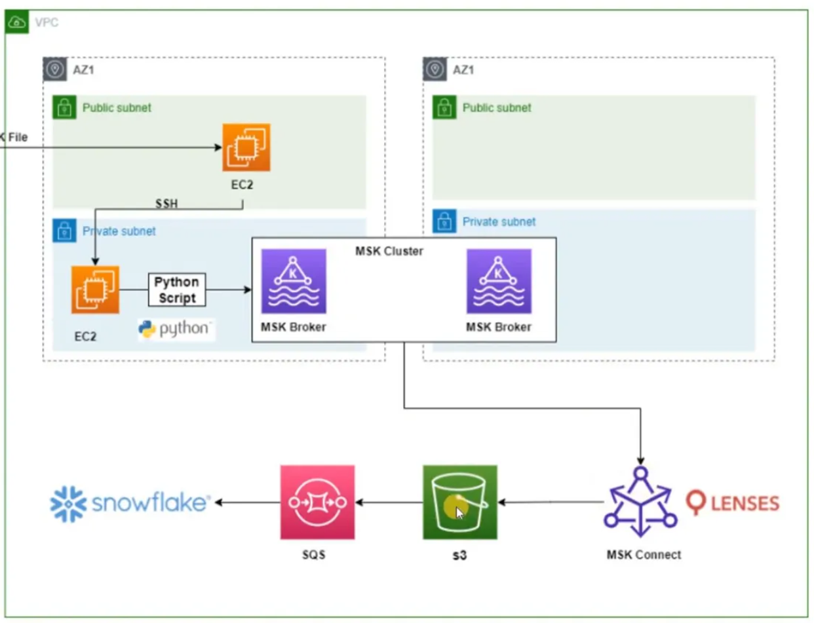

# AWS MSK Architecture: End-to-End Implementation Guide

## Table of Contents
1. [Architecture Overview](#architecture-overview)
2. [Prerequisites](#prerequisites)
3. [Cost Estimation](#cost-estimation)
4. [Step-by-Step Implementation](#step-by-step-implementation)
   - [STEP 1: Create a VPC](#step-1-create-a-vpc)
   - [STEP 2: Create Subnets (Public + Private across 2 AZs)](#step-2-create-subnets)
   - [STEP 3: Create Internet Gateway](#step-3-create-internet-gateway)
   - [STEP 4: Create NAT Gateway](#step-4-create-nat-gateway)
   - [STEP 5: Configure Route Tables](#step-5-configure-route-tables)
   - [STEP 6: Create Security Groups](#step-6-create-security-groups)
   - [STEP 7: Create Key Pair](#step-7-create-key-pair)
   - [STEP 8: Launch Bastion EC2 (Public Subnet)](#step-8-launch-bastion-ec2-public-subnet)
   - [STEP 9: Launch Worker EC2 (Private Subnet)](#step-9-launch-worker-ec2-private-subnet)
   - [STEP 10: Create MSK Cluster](#step-10-create-msk-cluster)
   - [STEP 11: Create S3 Bucket](#step-11-create-s3-bucket)
   - [STEP 12: Create SQS Queue](#step-12-create-sqs-queue)
   - [STEP 13: Connect to EC2s and Deploy Python Script](#step-13-connect-to-ec2s-and-deploy-python-script)
   - [STEP 14: Set Up MSK Connect with Lenses (S3 Sink Connector)](#step-14-set-up-msk-connect-with-lenses-s3-sink-connector)
   - [STEP 15: Configure S3 → SQS → Snowflake Pipeline](#step-15-configure-s3--sqs--snowflake-pipeline)
5. [Verification & Testing](#verification--testing)
6. [Troubleshooting](#troubleshooting)
7. [Clean Up](#clean-up)
8. [Best Practices](#best-practices)

---

## Architecture Overview

### What You're Building



### Data Flow Summary

| Step | From | To | Method |
|------|------|----|--------|
| 1 | User | Bastion EC2 (Public) | SSH with PPK file |
| 2 | Bastion EC2 | Worker EC2 (Private) | SSH (internal) |
| 3 | Worker EC2 | MSK Cluster | Python Script (Kafka Producer) |
| 4 | MSK Cluster | S3 | MSK Connect (Lenses S3 Sink Connector) |
| 5 | S3 | SQS | S3 Event Notification |
| 6 | SQS | Snowflake | Snowpipe or SQS trigger |

### Key Components

| Component | Purpose | Location |
|-----------|---------|----------|
| **Bastion EC2** | Entry point / Jump server for SSH | Public Subnet, AZ1 |
| **Worker EC2** | Runs Python Kafka Producer script | Private Subnet, AZ1 |
| **MSK Cluster** | Managed Apache Kafka (2 brokers) | Private Subnets, AZ1 & AZ2 |
| **MSK Connect** | Kafka connector framework | Managed by AWS |
| **Lenses** | S3 Sink Connector plugin for MSK Connect | Configured in MSK Connect |
| **S3** | Stores Kafka messages as files | AWS Global |
| **SQS** | Queue that triggers Snowflake ingestion | AWS Global |
| **Snowflake** | Data warehouse / final destination | External |

---

## Prerequisites

### AWS Account Requirements
- AWS Account (free tier or paid)
- IAM permissions: EC2, VPC, MSK, S3, SQS, IAM
- AWS CLI installed (optional but recommended)
- SSH client (Mac/Linux: built-in | Windows: PuTTY or Git Bash)

### Snowflake Requirements
- Snowflake account with ACCOUNTADMIN role
- A target database and schema created

### Cost Awareness
> ⚠️ **MSK is NOT free tier eligible. Expect charges.**

---

## Cost Estimation

### Monthly Cost Breakdown

| Resource | Type | Price | Monthly Estimate |
|----------|------|-------|-----------------|
| EC2 t2.micro (Bastion) | On-Demand | $0.0116/hr | ~$8.50 |
| EC2 t2.micro (Worker) | On-Demand | $0.0116/hr | ~$8.50 |
| MSK Brokers (2x kafka.t3.small) | On-Demand | $0.054/hr each | ~$79 |
| MSK Storage (2x 100GB) | EBS | $0.10/GB-month | ~$20 |
| NAT Gateway | Per hour | $0.045/hr | ~$33 |
| NAT Gateway data | Per GB | $0.045/GB | Varies |
| S3 Storage | Standard | $0.023/GB | ~$1 |
| SQS | Per million requests | $0.40/million | ~$1 |
| MSK Connect | Per MCU-hour | $0.11/MCU-hr | ~$8 |
| **TOTAL** | | | **~$160/month** |

### How to Keep Costs Low
1. **Delete MSK cluster** when not in use (biggest cost driver)
2. Use **kafka.t3.small** (smallest broker size)
3. **Stop EC2 instances** when not in use
4. **Delete NAT Gateway** when not needed
5. Set up **AWS Billing Alerts** at $50 threshold

---

## Step-by-Step Implementation

---

### STEP 1: Create a VPC

**What is a VPC?**
Your private isolated network in AWS. All resources will live inside this VPC.

**How to Create:**

1. Go to **AWS Console** → Search **"VPC"**
2. Click **"VPCs"** on the left sidebar
3. Click **"Create VPC"**
4. Fill in:
   ```
   Resource to create:   VPC only
   VPC Name:             msk-demo-vpc
   IPv4 CIDR Block:      10.0.0.0/16
   IPv6 CIDR Block:      No IPv6
   Tenancy:              Default
   ```
5. Click **"Create VPC"**

**IP Range Explanation:**
- `10.0.0.0/16` = 65,536 available IP addresses
- We will carve this into 4 smaller subnets

---

### STEP 2: Create Subnets

We need **4 subnets** — 2 public and 2 private, spread across 2 Availability Zones.

| Subnet Name | Type | AZ | CIDR |
|-------------|------|----|------|
| public-subnet-az1 | Public | us-east-1a | 10.0.1.0/24 |
| public2-subnet-az2 | Public | us-east-1b | 10.0.2.0/24 |
| private-subnet-az1 | Private | us-east-1a | 10.0.3.0/24 |
| private2-subnet-az2 | Private | us-east-1b | 10.0.4.0/24 |

**Why 4 subnets?**
- Public subnets: For the Bastion EC2 that needs internet access
- Private subnets: For the Worker EC2 and MSK Brokers — kept away from direct internet exposure
- 2 AZs: MSK requires at least 2 Availability Zones for high availability

**Create Each Subnet:**

1. Go to **VPC Dashboard** → **"Subnets"**
2. Click **"Create Subnet"**
3. Select **VPC**: `msk-demo-vpc`
4. Create all 4 subnets one by one with values from the table above

**Enable Auto-Assign Public IP for Public Subnets:**

After creating public subnets:
1. Select `public-subnet-az1`
2. Click **"Actions"** → **"Edit subnet settings"**
3. Check ✅ **"Enable auto-assign public IPv4 address"**
4. Click **"Save"**
5. Repeat for `public-subnet-az2`

> ⚠️ Do NOT enable auto-assign IP for private subnets.

---

### STEP 3: Create Internet Gateway

**What is an Internet Gateway (IGW)?**
The gateway between your VPC and the public internet. Required for your Bastion EC2 to be accessible from outside.

**How to Create:**

1. Go to **VPC Dashboard** → **"Internet Gateways"**
2. Click **"Create Internet Gateway"**
3. Fill in:
   ```
   Name: msk-demo-igw
   ```
4. Click **"Create Internet Gateway"**
5. Select `msk-demo-igw`
6. Click **"Actions"** → **"Attach to VPC"**
7. Select `msk-demo-vpc`
8. Click **"Attach Internet Gateway"**

**Verify:** IGW State should show **"Attached"**

---

### STEP 4: Create NAT Gateway

**What is a NAT Gateway?**
A NAT (Network Address Translation) Gateway allows your **private subnet** resources (Worker EC2, MSK) to access the internet **outbound only** (e.g., to download packages), without being directly reachable from the internet.

> ✅ Worker EC2 needs this to install Python packages (pip install) and to communicate outbound.

**How to Create:**

1. Go to **VPC Dashboard** → **"NAT Gateways"**
2. Click **"Create NAT Gateway"**
3. Fill in:
   ```
   Name:              msk-demo-nat
   Subnet:            public-subnet-az1   ← IMPORTANT: NAT Gateway MUST be in PUBLIC subnet
   Connectivity type: Public
   ```
4. Click **"Allocate Elastic IP"** (this assigns a public IP to the NAT Gateway)
5. Click **"Create NAT Gateway"**
6. Wait until status shows **"Available"** (takes 1-2 minutes)

> ⚠️ NAT Gateway costs ~$0.045/hr. Delete it when not in use.

---

### STEP 5: Configure Route Tables

Route tables tell network traffic where to go. We need **2 separate route tables**:
- **Public Route Table**: Routes internet traffic through IGW
- **Private Route Table**: Routes internet traffic through NAT Gateway

#### Create Public Route Table

1. Go to **VPC Dashboard** → **"Route Tables"**
2. Click **"Create Route Table"**
3. Fill in:
   ```
   Name: public-route-table
   VPC:  msk-demo-vpc
   ```
4. Click **"Create Route Table"**
5. Select `public-route-table` → click **"Routes"** tab → **"Edit Routes"**
6. Click **"Add Route"**:
   ```
   Destination: 0.0.0.0/0
   Target:      Internet Gateway → msk-demo-igw
   ```
7. Click **"Save Routes"**
8. Click **"Subnet Associations"** tab → **"Edit Subnet Associations"**
9. Select `public-subnet-az1` and `public-subnet-az2`
10. Click **"Save Associations"**

**Final public route table should look like:**
```
Destination     Target
10.0.0.0/16   → local
0.0.0.0/0     → igw-xxxxxxxx
```

#### Create Private Route Table

1. Click **"Create Route Table"** again
2. Fill in:
   ```
   Name: private-route-table
   VPC:  msk-demo-vpc
   ```
3. Click **"Create Route Table"**
4. Select `private-route-table` → **"Routes"** tab → **"Edit Routes"**
5. Click **"Add Route"**:
   ```
   Destination: 0.0.0.0/0
   Target:      NAT Gateway → msk-demo-nat
   ```
6. Click **"Save Routes"**
7. Click **"Subnet Associations"** tab → **"Edit Subnet Associations"**
8. Select `private-subnet-az1` and `private-subnet-az2`
9. Click **"Save Associations"**

**Final private route table should look like:**
```
Destination     Target
10.0.0.0/16   → local
0.0.0.0/0     → nat-xxxxxxxx
```

---

### STEP 6: Create Security Groups

We need **3 security groups** with specific rules for each component.

#### Security Group 1: Bastion SG (For Public EC2)

1. Go to **VPC Dashboard** → **"Security Groups"** → **"Create Security Group"**
2. Fill in:
   ```
   Name:        bastion-sg
   Description: Security group for bastion/jump EC2
   VPC:         msk-demo-vpc
   ```
3. **Inbound Rules:**
   ```
   Type: SSH | Protocol: TCP | Port: 22 | Source: YOUR_IP/32
   Type: HTTPS | Protocol: TCP | Port: 443 | Source: 0.0.0.0/0
   Type: HTTP | Protocol: TCP | Port: 80 | Source: 0.0.0.0/0
   ```
   > 🔒 Replace `YOUR_IP` with your actual IP from https://checkip.amazonaws.com
4. **Outbound Rules:** Leave as default (All traffic allowed)
5. Click **"Create Security Group"**

#### Security Group 2: Worker SG (For Private EC2)

1. Click **"Create Security Group"** again
2. Fill in:
   ```
   Name:        worker-sg
   Description: Security group for worker EC2 in private subnet
   VPC:         msk-demo-vpc
   ```
3. **Inbound Rules:**
   ```
   Type: SSH | Protocol: TCP | Port: 22 | Source: bastion-sg  ← select the bastion SG, not 0.0.0.0/0
   Type: All ICMP - IPv4 | Protocol: ICMP | Port: All | Source: bastion-sg  ← select the bastion SG, not 0.0.0.0/0
   ```
   > ✅ This allows SSH only FROM the bastion EC2, not from the internet
4. **Outbound Rules:** Leave as default
5. Click **"Create Security Group"**

#### Security Group 3: MSK SG (For MSK Cluster)

1. Click **"Create Security Group"** again
2. Fill in:
   ```
   Name:        msk-sg
   Description: Security group for MSK Kafka cluster
   VPC:         msk-demo-vpc
   ```
3. **Inbound Rules:**
   ```
   Type: Custom TCP | Port: 9092  | Source: worker-sg   ← Kafka plaintext
   Type: Custom TCP | Port: 9094  | Source: worker-sg   ← Kafka TLS
   Type: Custom TCP | Port: 9092  | Source: msk-sg      ← Broker-to-broker (for self-reference first save the rule edit it and select )
   ```
4. **Outbound Rules:** Leave as default
5. Click **"Create Security Group"**

---

### STEP 7: Create Key Pair

**What is a Key Pair?**
Used to SSH into your EC2 instances. AWS stores the public key; you keep the private key.

**How to Create:**

1. Go to **EC2 Dashboard** → **"Key Pairs"** (under Network & Security)
2. Click **"Create Key Pair"**
3. Fill in:
   ```
   Name:               kp-Bastion-mks-mhs
   Key Pair Type:      RSA
   Private Key Format: .pem (Mac/Linux) or .ppk (Windows PuTTY)
   ```
4. Click **"Create Key Pair"**
5. File downloads automatically to your `Downloads` folder

do the same for second ec2

**Secure Your Key (Run on YOUR LOCAL machine):**

```bash
# Mac/Linux
mkdir -p ~/.ssh
cp ~/Downloads/kp-Bastion-mks-mhs.pem ~/.ssh/
chmod 400 ~/.ssh/kp-Bastion-mks-mhs.pem

cp ~/Downloads/Kp-worker-mks-mhs.pem ~/.ssh/
chmod 400 ~/.ssh/Kp-worker-mks-mhs.pem

# Verify
ls -la ~/.ssh/kp-Bastion-mks-mhs.pem
ls -la ~/.ssh/Kp-worker-mks-mhs.pem
# Expected: -r--------  1 user group  1234 ...
```

> ⚠️ Never share your `.pem` file or commit it to GitHub.

---

### STEP 8: Launch Bastion EC2 (Public Subnet)

**What is a Bastion Host?**
A "jump server" — it lives in the public subnet and is the only entry point into your private network. You SSH into the bastion first, then SSH from it into your private EC2.

**How to Launch:**

1. Go to **EC2 Dashboard** → **"Instances"** → **"Launch Instances"**
2. Fill in:

   **Name and OS:**
   ```
   Name:     bastion-ec2
   AMI:      Amazon Linux 2023
   Instance Type: t2.micro
   ```

   **Key Pair:**
   ```
   Key Pair: kp-Bastion-mks-mhs
   ```

   **Network Settings:**
   ```
   VPC:                   msk-demo-vpc
   Subnet:                public-subnet-az1
   Auto-assign Public IP: Enable
   Security Group:        bastion-sg  (select existing)
   ```

   **Storage:**
   ```
   Root Volume: 8 GB (default)
   ```

3. Click **"Launch Instance"**
4. Wait for state: **"Running"** 
5. Note the **Public IPv4 Address** (e.g., `54.208.123.45`)

---

### STEP 9: Launch Worker EC2 (Private Subnet)

This EC2 lives in the private subnet. It will run the Python Kafka producer script.

**How to Launch:**

1. Go to **EC2 Dashboard** → **"Instances"** → **"Launch Instances"**
2. Fill in:

   **Name and OS:**
   ```
   Name:          worker-ec2
   AMI:           Amazon Linux 2023
   Instance Type: t2.micro
   ```

   **Key Pair:**
   ```
   Key Pair: Kp-worker-mks-mhs.pem
   ```

   **Network Settings:**
   ```
   VPC:                   msk-demo-vpc
   Subnet:                private-subnet-az1
   Auto-assign Public IP: Disable  ← No public IP for private instances!
   Security Group:        worker-sg  (select existing)
   ```

   **Storage:**
   ```
   Root Volume: 8 GB
   ```

3. Click **"Launch Instance"**
4. Wait for state: **"Running"** 
5. Note the **Private IPv4 Address** (e.g., `10.0.3.50`) — you'll need this for SSH

---

### STEP 10: Create IAM role for Private EC2

1. Go to **IAM Dashboard** → **"ROLE"** → **"CREATE ROLE"**
2. select trusted entity (AWS service)
3. select use case (EC2)
4. Attach policy 
      AmazonS3FullAccess
      AmazonMSKFullAccess
5. name it and create it
6. then got to private ec2 instance click on action -> security -> modify IAM role -> select that role and attach it


### STEP 10: Create MSK Cluster

**What is an MSK Cluster?**
Your managed Apache Kafka cluster. It consists of multiple **brokers** (Kafka servers) spread across Availability Zones.

**How to Create:**

1. Go to **AWS Console** → Search **"MSK"** → Click **"Amazon MSK"**
2. Click **"Create Cluster"**
3. Select **"Custom Create"**

**Cluster Settings:**

```
Cluster Name:    msk-demo-cluster
Cluster Type:    Provisioned
Broker type:     Standard brokers
Apache Kafka Version: 3.9.x  
Metadata mode - new: KRaft
```

**Broker Settings:**

```
Broker Type:          kafka.m5.24xlarge  ← cheapest option
Number of zones:      2
Brokers per zone:     1
Total brokers:        2
```

**Storage:**

```
Storage per broker:   1000 GiB  
```

**Networking:**

```
VPC:                msk-demo-vpc
Zones and Subnets:
  Zone 1 (AZ1):    private-subnet-az1
  Zone 2 (AZ2):    private-subnet-az2
Security Groups:    msk-sg
```

**Security:**

```
Access Control Methods:  Unauthenticated access  (for simplicity in dev)
Encryption (Between clients and brokers): plaintext
within the cluster (TLS encryption)
```

**Monitoring (Optional):**
```
Basic monitoring: Enabled 
Broker log delivery: Deliver to Amazon CloudWatch Logs
```

4. Click **"Create Cluster"**

> MSK cluster takes **15-20 minutes** to provision. Get a coffee!

**Get Broker Endpoints (after cluster is Active):**

1. Click on `msk-demo-cluster`
2. Click **"View client information"**
3. Copy the **Bootstrap servers (Plaintext)** — looks like:
   ```
   b-1.msk-demo-cluster.xxxx.c2.kafka.us-east-1.amazonaws.com:9092,
   b-2.msk-demo-cluster.xxxx.c2.kafka.us-east-1.amazonaws.com:9092
   ```
4. Save this — you'll need it for your Python script

---

### STEP 11: Create S3 Bucket

S3 will store the Kafka messages exported by MSK Connect.

**How to Create:**

1. Go to **AWS Console** → Search **"S3"**
2. Click **"Create Bucket"**
3. Fill in:
   ```
   Bucket Name:    msk-demo-kafka-data-<your-name>  ← must be globally unique
   Region:         us-east-1  (same as your VPC)
   ACLs:           Disabled
   Block Public:   Keep all public access blocked 
   Versioning:     Disable (for now)
   ```
4. Click **"Create Bucket"**

---

### STEP 12: Create SQS Queue

SQS will receive notifications when new files land in S3, triggering Snowflake ingestion.

**How to Create:**

1. Go to **AWS Console** → Search **"SQS"**
2. Click **"Create Queue"**
3. Fill in:
   ```
   Type:  Standard
   Name:  msk-demo-snowflake-queue
   ```
4. Scroll down to **"Access Policy"** → switch to **"Advanced"**
5. Replace the policy with this (replace `YOUR_BUCKET_NAME` and `YOUR_ACCOUNT_ID`):

```json
{
  "Version": "2012-10-17",
  "Statement": [
    {
      "Effect": "Allow",
      "Principal": {
        "Service": "s3.amazonaws.com"
      },
      "Action": "SQS:SendMessage",
      "Resource": "arn:aws:sqs:us-east-1:YOUR_ACCOUNT_ID:msk-demo-snowflake-queue",
      "Condition": {
        "ArnLike": {
          "aws:SourceArn": "arn:aws:s3:::YOUR_BUCKET_NAME"
        }
      }
    }
  ]
}
```

6. Click **"Create Queue"**

**Enable S3 → SQS Notification:**

1. Go to your S3 bucket (`msk-demo-kafka-data-...`)
2. Click **"Properties"** tab
3. Scroll to **"Event Notifications"** → **"Create Event Notification"**
4. Fill in:
   ```
   Event Name:     new-kafka-file
   Prefix:         topics/  (or leave blank for all files)
   Event Types:    s3:ObjectCreated:*
   Destination:    SQS Queue → msk-demo-snowflake-queue
   ```
5. Click **"Save Changes"**

---

### STEP 13: Connect to EC2s and Deploy Python Script

#### Step 13a: Copy Your Key to Bastion EC2

To SSH from Bastion into the private Worker EC2, you need to copy your `.pem` key to the Bastion server.

```bash
# On YOUR LOCAL machine — copy key to bastion

scp -i "kp-Bastion-mks-mhs.pem" Kp-worker-mks-mhs.pem ec2-user@18.234.200.221:/home/ec2-user/

# SSH into Bastion
ssh -i "kp-Bastion-mks-mhs.pem" ec2-user@18.234.200.221
```

#### Step 13b: From Bastion, SSH into Worker EC2

```bash
# You're now ON THE BASTION EC2
# Fix key permissions
chmod 400 Kp-worker-mks-mhs.pem

# SSH into the Worker EC2 (using its PRIVATE IP)
ssh -i "Kp-worker-mks-mhs.pem" ec2-user@10.0.2.48
```

You should see the Amazon Linux welcome screen again — now you're on the Worker EC2.

#### Step 13c: Install Python Dependencies on Worker EC2

```bash
# Update packages
sudo yum update -y

# Install pip
sudo yum install -y python3-pip

# Install java
sudo yum install java-17-amazon-corretto -y

# Install Kafka Python client
pip3 install kafka-python

# Verify install
python3 -c 'from kafka import KafkaProducer; print("Kafka client ready!")'
```

#### Step 13d: Create a Kafka Topic (on Worker EC2)

Before producing messages, create a topic in MSK.

```bash
# Download Kafka binaries to use the kafka-topics.sh tool
wget https://archive.apache.org/dist/kafka/3.5.1/kafka_2.13-3.5.1.tgz
tar -xzf kafka_2.13-3.5.1.tgz
cd kafka_2.13-3.5.1

# Create a topic (replace BROKER_ENDPOINTS with your MSK bootstrap servers)
bin/kafka-topics.sh \
  --create \
  --topic demo-topic \
  --bootstrap-server b-2.mskdemocluster.eq1kwf.c24.kafka.us-east-1.amazonaws.com:9092,b-1.mskdemocluster.eq1kwf.c24.kafka.us-east-1.amazonaws.com:9092 \
  --partitions 2 \
  --replication-factor 2

# Verify topic was created
bin/kafka-topics.sh \
  --list \
  --bootstrap-server b-2.mskdemocluster.eq1kwf.c24.kafka.us-east-1.amazonaws.com:9092,b-1.mskdemocluster.eq1kwf.c24.kafka.us-east-1.amazonaws.com:9092
```

#### Step 13e: Deploy Python Producer Script

```bash
# Create the Python script
sudo nano kafka_producer.py


from kafka import KafkaProducer
import json
import time
import datetime

BOOTSTRAP_SERVERS = [
    'b-1.mskdemocluster.eq1kwf.c24.kafka.us-east-1.amazonaws.com:9092',
    'b-2.mskdemocluster.eq1kwf.c24.kafka.us-east-1.amazonaws.com:9092'
]

TOPIC_NAME = 'demo-topic'

producer = KafkaProducer(
    bootstrap_servers=BOOTSTRAP_SERVERS,
    value_serializer=lambda v: json.dumps(v).encode('utf-8'),
    key_serializer=lambda v: v.encode('utf-8') if v else None
)

print("Producer started")

count = 0
while True:
    message = {
        'id': count,
        'timestamp': str(datetime.datetime.utcnow()),
        'source': 'worker-ec2',
        'data': f'Sample event number {count}'
    }

    future = producer.send(
        TOPIC_NAME,
        key=f'key-{count}',
        value=message
    )

    record_metadata = future.get(timeout=10)

    print(f"Sent message {count} → partition {record_metadata.partition}, offset {record_metadata.offset}")

    count += 1
    time.sleep(2)
```

```bash
cat kafka_producer.py
# Run the script
python3 kafka_producer.py
```

**Expected output:**
```
Connected to MSK cluster. Producing to topic: demo-topic
Sent message 0 → partition 1, offset 0
Sent message 1 → partition 0, offset 0
Sent message 2 → partition 1, offset 1
...
```

Press `Ctrl+C` to stop.

---

### STEP 14: Set Up MSK Connect with Lenses (S3 Sink Connector)

MSK Connect allows Kafka data to flow automatically into S3.

#### Step 14a: Create IAM Role for MSK Connect

1. Go to **AWS Console** → **"IAM"** → **"Roles"** → **"Create Role"**
2. Select:
   ```
   Trusted Entity: AWS Service
   Use Case:       EC@
   ```
3. Attach these policies:
   ```
   AmazonS3FullAccess
   AmazonMSKFullAccess
   cloudwatchfullaccess
   ```
4. Name the role: `msk-connect-role`
5. Click **"Create Role"**
6. after creating it got to the role select it edit the policy and attach this policy
      
{
  "Version": "2012-10-17",
  "Statement": [
    {
      "Effect": "Allow",
      "Principal": {
        "Service": "kafkaconnect.amazonaws.com"
      },
      "Action": "sts:AssumeRole"
    }
  ]
}

#### Step 14b: Create a Custom Plugin (Lenses S3 Sink Connector)

MSK Connect needs a **plugin**.

1. Download the Lenses S3 Sink Connector JAR from:
   `https://www.confluent.io/hub/confluentinc/kafka-connect-s3`
   (or use the open-source `kafka-connect-s3` from Confluent)

2. Upload the .zip to your S3 bucket:

you can also put the file manually by creating the plugin folder inside the bucket and then upload the zip file

   ```bash
   # From your local machine
   aws s3 cp kafka-connect-s3-10.5.0.jar s3://msk-demo-kafka-data-<your-name>/plugins/
   ```

3. Go to **MSK Console** → **"MSK Connect"** → **"Custom Plugins"** → **"Create Custom Plugin"**
4. Fill in:
   ```
   Plugin Name:   lenses-s3-sink-plugin
   S3 URI:        s3://msk-demo-kafka-data-<your-name>/plugins/kafka-connect-s3-10.5.0.jar
   ```
5. Click **"Create Custom Plugin"**
6. Wait for status: **"Active"**

#### Step 14c: Create the MSK Connect Connector

1. Go to **MSK Console** → **"MSK Connect"** → **"Connectors"** → **"Create Connector"**
2. Select: (Use existing customised plugin) and then select the plugin which you have created `lenses-s3-sink-plugin`
3. Click **"Next"**


**Connector Configuration:**
```
Connector Name: s3-sink-connector
select cluster type MSK cluster
```

**Connector Configuration (paste this):**
```properties
connector.class=io.confluent.connect.s3.S3SinkConnector
tasks.max=2
topics=demo-topic
s3.region=us-east-1
s3.bucket.name=msk-demo-kafka-data-<your-name>
s3.part.size=5242880
flush.size=10
storage.class=io.confluent.connect.s3.storage.S3Storage
format.class=io.confluent.connect.s3.format.json.JsonFormat
schema.compatibility=NONE
locale=en_US
timezone=UTC
timestamp.extractor=Wallclock
```

**Capacity:**
```
Capacity Type:   Provisioned
MCU count:       1
Worker count:    1
```

select 3.7.x(recommended) in Apache Kafka Connect version

**Worker Configuration:** Use default

**Security:**
```
Service Execution Role: msk-connect-role
```


4. Click **"Create Connector"**
5. Wait for status: **"Running"** 

**Verify Data in S3:**
After running your Python producer for a few minutes, check S3:
```
msk-demo-kafka-data-<your-name>/
  └── topics/
       └── demo-topic/
            └── partition=0/
                 └── demo-topic+0+0000000000.json
```

---

### STEP 15: Configure S3 → SQS → Snowflake Pipeline

#### Step 15a: Set Up Snowflake Snowpipe

In Snowflake, run these SQL commands:

```sql
-- Create database and schema
CREATE DATABASE IF NOT EXISTS kafka_demo;
USE DATABASE kafka_demo;
CREATE SCHEMA IF NOT EXISTS raw;
USE SCHEMA raw;

-- Create target table
CREATE TABLE IF NOT EXISTS kafka_messages (
    id          NUMBER,
    timestamp   TIMESTAMP,
    source      VARCHAR,
    data        VARCHAR,
    loaded_at   TIMESTAMP DEFAULT CURRENT_TIMESTAMP()
);

-- Create file format for JSON
CREATE OR REPLACE FILE FORMAT json_format
    TYPE = 'JSON'
    STRIP_OUTER_ARRAY = TRUE;

-- Create stage pointing to your S3 bucket
CREATE OR REPLACE STAGE kafka_s3_stage
    URL = 's3://msk-demo-kafka-data-<your-name>/topics/demo-topic/'
    CREDENTIALS = (
        AWS_KEY_ID = '<your-aws-access-key>'
        AWS_SECRET_KEY = '<your-aws-secret-key>'
    )
    FILE_FORMAT = json_format;

-- Create Snowpipe for automatic ingestion
CREATE OR REPLACE PIPE kafka_pipe AUTO_INGEST = TRUE AS
    COPY INTO kafka_messages (id, timestamp, source, data)
    FROM (
        SELECT
            $1:id::NUMBER,
            $1:timestamp::TIMESTAMP,
            $1:source::VARCHAR,
            $1:data::VARCHAR
        FROM @kafka_s3_stage
    )
    FILE_FORMAT = json_format;

-- Get the SQS ARN for Snowpipe (needed to link to your SQS queue)
SHOW PIPES;
-- Copy the "notification_channel" value — this is the Snowpipe SQS ARN
```

#### Step 15b: Link Snowpipe to Your SQS Queue

1. In **Snowflake**, run `SHOW PIPES` and copy the `notification_channel` ARN
2. Go to your **SQS Queue** (`msk-demo-snowflake-queue`) in AWS Console
3. Click **"Subscribe to Amazon SNS topic"** or note that S3 notifications already point here

> Alternatively: Configure Snowflake to directly use your SQS queue ARN as the notification channel in the pipe definition using `INTEGRATION` approach for production setups.

#### Step 15c: Verify End-to-End Flow

```sql
-- Wait a few minutes after your Python producer runs, then check:
SELECT COUNT(*) FROM kafka_messages;

SELECT * FROM kafka_messages ORDER BY loaded_at DESC LIMIT 10;
```

**Expected output:**
```
+----+---------------------+-----------+----------------------+---------------------+
| ID | TIMESTAMP           | SOURCE    | DATA                 | LOADED_AT           |
+----+---------------------+-----------+----------------------+---------------------+
|  5 | 2024-01-01 10:00:05 | worker-ec2| Sample event number 5| 2024-01-01 10:01:00 |
|  4 | 2024-01-01 10:00:03 | worker-ec2| Sample event number 4| 2024-01-01 10:01:00 |
...
```

---

## Verification & Testing

### Checklist — Is Everything Working?

**Networking:**
- [ ] VPC created (10.0.0.0/16)
- [ ] 4 Subnets created (2 public, 2 private across 2 AZs)
- [ ] Internet Gateway attached to VPC
- [ ] NAT Gateway in public subnet with Elastic IP
- [ ] Public route table → IGW (for public subnets)
- [ ] Private route table → NAT Gateway (for private subnets)
- [ ] 3 Security Groups created (bastion-sg, worker-sg, msk-sg)

**Compute:**
- [ ] Bastion EC2 running in public subnet with public IP
- [ ] Worker EC2 running in private subnet (no public IP)
- [ ] Can SSH into Bastion from local machine
- [ ] Can SSH from Bastion into Worker EC2

**MSK:**
- [ ] MSK Cluster status: Active
- [ ] Both brokers showing in cluster details
- [ ] Kafka topic `demo-topic` created
- [ ] Python producer sending messages successfully

**Data Pipeline:**
- [ ] MSK Connect connector status: Running
- [ ] Files appearing in S3 bucket under `topics/`
- [ ] SQS queue receiving messages from S3
- [ ] Snowflake table receiving data via Snowpipe

### Quick Tests

```bash
# Test 1: Internet access from Worker EC2 (via NAT Gateway)
ping -c 3 google.com
# Expected: packets received

# Test 2: MSK connectivity from Worker EC2
nc -zv <BROKER_ENDPOINT> 9092
# Expected: "Connection to ... succeeded"

# Test 3: Kafka consumer — verify messages are in MSK
cd kafka_2.13-3.5.1
bin/kafka-console-consumer.sh \
  --topic demo-topic \
  --bootstrap-server <BROKER_ENDPOINTS>:9092 \
  --from-beginning \
  --max-messages 5
```

---

## Troubleshooting

### Cannot SSH into Bastion EC2

**Symptoms:** `Connection timed out`

**Fixes:**
1. Check `bastion-sg` allows SSH (port 22) from your IP
2. Verify instance has a Public IP
3. Confirm IGW is attached to VPC
4. Verify public subnet has route to IGW

```bash
# Verify your current IP
curl https://checkip.amazonaws.com
# Update the bastion-sg inbound rule with this exact IP
```

### Cannot SSH from Bastion to Worker EC2

**Symptoms:** `Permission denied` or `Connection timed out`

**Fixes:**
1. Verify `.pem` key was copied to Bastion (`ls ~/.ssh/`)
2. Check `chmod 400 ~/.ssh/msk-demo-keypair.pem` was run on Bastion
3. Confirm `worker-sg` allows SSH from `bastion-sg` (not 0.0.0.0/0)
4. Confirm you're using the Worker's **Private IP**, not public

### Python Script Cannot Connect to MSK

**Symptoms:** `NoBrokersAvailable` or timeout

**Fixes:**
1. Verify `msk-sg` allows port 9092 from `worker-sg`
2. Confirm MSK cluster status is **Active** (not Creating)
3. Check broker endpoints are correct (copy fresh from console)
4. Verify Worker EC2 is in the same VPC as MSK

```bash
# Test TCP connectivity to MSK broker
nc -zv b-1.msk-demo-cluster.xxxx.kafka.us-east-1.amazonaws.com 9092
```

### MSK Connect Not Writing to S3

**Symptoms:** S3 bucket empty after connector is "Running"

**Fixes:**
1. Check `msk-connect-role` has `AmazonS3FullAccess`
2. Verify the S3 bucket name in connector config matches exactly
3. Confirm topic name in connector config matches your Kafka topic
4. Check connector logs in CloudWatch:
   - Go to **CloudWatch** → **Log Groups** → search `msk-connect`

### Snowflake Not Receiving Data

**Symptoms:** `COUNT(*)` returns 0

**Fixes:**
1. Verify Snowpipe `AUTO_INGEST = TRUE` is set
2. Check S3 stage URL and credentials are correct
3. Run manual copy to test:
   ```sql
   COPY INTO kafka_messages FROM @kafka_s3_stage;
   SELECT SYSTEM$PIPE_STATUS('kafka_pipe');
   ```
4. Check Snowpipe error history:
   ```sql
   SELECT * FROM TABLE(INFORMATION_SCHEMA.COPY_HISTORY(
     TABLE_NAME => 'kafka_messages',
     START_TIME => DATEADD(hours, -1, CURRENT_TIMESTAMP())
   ));
   ```

---

## Clean Up

### ⚠️ IMPORTANT: Delete in This Exact Order

Deleting in the wrong order will cause dependency errors.

#### 1. Stop Python Producer
```bash
# On Worker EC2 — press Ctrl+C to stop the producer
```

#### 2. Delete MSK Connect Connector
1. **MSK Console** → **MSK Connect** → **Connectors**
2. Select `s3-sink-connector` → **Delete**
3. Wait until deleted

#### 3. Delete MSK Connect Custom Plugin
1. **MSK Connect** → **Custom Plugins**
2. Select `lenses-s3-sink-plugin` → **Delete**

#### 4. Delete MSK Cluster
1. **MSK Console** → **Clusters**
2. Select `msk-demo-cluster` → **Actions** → **Delete**
3. Type the cluster name to confirm
4. Wait ~10 minutes for deletion

#### 5. Terminate EC2 Instances
1. **EC2 Dashboard** → **Instances**
2. Select both `bastion-ec2` and `worker-ec2`
3. **Instance State** → **Terminate**
4. Confirm

#### 6. Delete NAT Gateway
1. **VPC Dashboard** → **NAT Gateways**
2. Select `msk-demo-nat` → **Actions** → **Delete**
3. Wait until deleted

#### 7. Release Elastic IP
1. **VPC Dashboard** → **Elastic IPs**
2. Select the IP → **Actions** → **Release Elastic IP address**

#### 8. Delete Internet Gateway
1. **VPC Dashboard** → **Internet Gateways**
2. Select `msk-demo-igw` → **Actions** → **Detach from VPC** → confirm
3. Then **Actions** → **Delete** → confirm

#### 9. Delete Subnets
1. **VPC Dashboard** → **Subnets**
2. Delete all 4 subnets one by one

#### 10. Delete Route Tables
1. **VPC Dashboard** → **Route Tables**
2. Delete `public-route-table` and `private-route-table`
3. Do NOT delete the "Main" route table (AWS will handle it with VPC deletion)

#### 11. Delete Security Groups
1. **VPC Dashboard** → **Security Groups**
2. Delete `msk-sg` first (it has no dependencies), then `worker-sg`, then `bastion-sg`
3. Cannot delete default SG — that's fine

#### 12. Delete VPC
1. **VPC Dashboard** → **VPCs**
2. Select `msk-demo-vpc` → **Actions** → **Delete VPC**

#### 13. Empty and Delete S3 Bucket
1. **S3 Console** → click bucket name
2. Click **"Empty"** → type `permanently delete` → confirm
3. Go back → select bucket → **Delete** → type bucket name → confirm

#### 14. Delete SQS Queue
1. **SQS Console** → select `msk-demo-snowflake-queue`
2. Click **"Delete"** → confirm

#### 15. Delete Key Pair
1. **EC2 Dashboard** → **Key Pairs**
2. Select `msk-demo-keypair` → **Actions** → **Delete**
3. Also remove the local file:
   ```bash
   rm ~/.ssh/msk-demo-keypair.pem
   ```

#### 16. Delete IAM Role
1. **IAM Console** → **Roles**
2. Search `msk-connect-role` → **Delete**

### Cleanup Verification Checklist

| Service | What to Check |
|---------|--------------|
| MSK | No clusters listed |
| EC2 | 0 running instances |
| VPC | Only default VPC remains |
| NAT Gateway | None listed |
| Elastic IPs | None allocated |
| S3 | Bucket deleted |
| SQS | Queue deleted |
| IAM | msk-connect-role deleted |

---

## Best Practices

### Security
- Always use a **Bastion/Jump host** — never put MSK or databases in public subnets
- Restrict **SSH access** to your specific IP, not `0.0.0.0/0`
- Use **IAM roles** for MSK Connect (never hardcode AWS keys in connectors)
- Enable **encryption in transit** (TLS) for MSK in production
- Enable **MSK authentication** (SASL/SCRAM or IAM) in production

### Networking
- Keep MSK in **private subnets only**
- Use **Security Group references** (not CIDR blocks) for inter-service rules
- Always use **multiple AZs** for MSK (minimum 2 brokers)
- Use **VPC Flow Logs** to monitor and debug network traffic

### Cost Management
- MSK `kafka.t3.small` is cheapest — use it for development
- **Delete the MSK cluster** when not in use (it's the largest cost)
- **Delete NAT Gateway** when not in use
- Use **MSK Serverless** for variable workloads to avoid paying for idle brokers
- Set **AWS Billing Alerts** at a comfortable threshold

### Production Readiness
For production, additionally add:
- MSK with **SASL/SCRAM or IAM authentication**
- **Schema Registry** for message format governance
- **CloudWatch Alarms** on MSK broker metrics (CPU, disk, network)
- **Auto Scaling** for MSK Connect workers
- **Dead Letter Queue** in SQS for failed messages
- **Snowflake Storage Integration** (instead of AWS key/secret in stage)
- **Infrastructure as Code** (Terraform or CloudFormation)

---

## Architecture Summary

```
You (Local Machine)
       │
       │ SSH + PPK File
       ▼
  Bastion EC2 (Public Subnet)
       │
       │ SSH (internal)
       ▼
  Worker EC2 (Private Subnet)
       │
       │ Python kafka-python library
       ▼
  MSK Cluster (2 Brokers, Private Subnets, Multi-AZ)
       │
       │ MSK Connect (S3 Sink Connector via Lenses plugin)
       ▼
  S3 Bucket (Raw Kafka messages as JSON)
       │
       │ S3 Event Notification
       ▼
  SQS Queue
       │
       │ Snowpipe (AUTO_INGEST)
       ▼
  Snowflake Table ✅
```

**Congratulations! You've built a production-grade real-time data streaming pipeline on AWS.**
