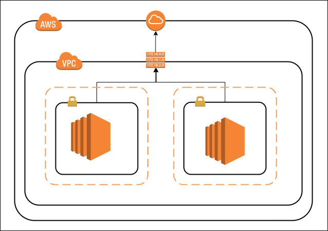
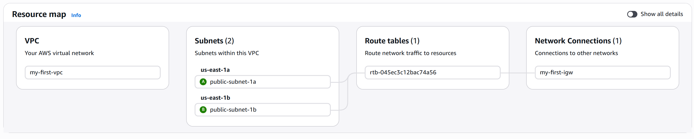

# AWS VPC Fundamentals: Complete Beginner's Guide
**By: Senior Data Engineer | 5+ Years AWS Experience**

---

## Table of Contents
1. [Architecture Overview](#architecture-overview)
2. [Prerequisites](#prerequisites)
3. [Cost Estimation](#cost-estimation)
4. [Step-by-Step Implementation](#step-by-step-implementation)
5. [Verification & Testing](#verification--testing)
6. [Troubleshooting](#troubleshooting)
7. [Clean Up & Cost Management](#clean-up--cost-management)
8. [Best Practices](#best-practices)

---

## Architecture Overview

### What You're Building



### Key Components

| Component | Purpose | Details |
|-----------|---------|---------|
| **VPC** | Virtual network | Isolated network space (10.0.0.0/16) |
| **Subnets** | Network segments | 2 public subnets across 2 AZs for redundancy |
| **Internet Gateway** | Internet connectivity | Allows public subnet ↔ Internet traffic |
| **Route Tables** | Traffic routing | Directs traffic based on destination IP |
| **Security Groups** | Firewall | Controls inbound/outbound traffic |
| **EC2 Instances** | Compute | Virtual servers running your applications |

---

## End Goal



## Prerequisites

### AWS Account Requirements
- ✅ AWS Account created (free tier eligible)
- ✅ Proper IAM permissions (EC2, VPC, IAM)
- ✅ AWS CLI installed (optional but recommended)
- ✅ SSH client (Mac/Linux: built-in | Windows: PuTTY or Git Bash)

### Local Setup
```bash
# Check AWS CLI is installed
aws --version

# Configure AWS credentials
aws configure
# You'll be prompted for:
# - AWS Access Key ID
# - AWS Secret Access Key
# - Default region: us-east-1
# - Default output format: json
```

### Cost Awareness (FREE TIER)
- EC2 t2.micro: **FREE** (750 hours/month for 12 months)
- VPC: **FREE**
- Data transfer within region: **FREE**
- Public IP (Elastic IP if stopped): **$0.005/hour when not attached**

**Estimated Monthly Cost:** $0 (if using free tier correctly)

---

## Cost Estimation

### Cost Breakdown (Without Free Tier)

| Resource | Type | Price | Monthly (730 hrs) |
|----------|------|-------|------------------|
| EC2 t2.micro | On-Demand | $0.0116/hr | $8.47 |
| Data Transfer | Out of AWS | $0.09/GB | ~$5.00 |
| Elastic IP | If unused | $0.005/hr | $3.65 |
| **TOTAL** | | | **~$17/month** |

### How to Keep Costs LOW:
1. ✅ Use **t2.micro** (free tier eligible)
2. ✅ **Stop instances** when not using (not terminate!)
3. ✅ Don't create **Elastic IPs** unnecessarily
4. ✅ **Delete resources** when done (follow cleanup steps)
5. ✅ Use **AWS Cost Explorer** to monitor

---

## Step-by-Step Implementation

### STEP 1: Create a VPC

**What is a VPC?**
A VPC is your private network in AWS. It's completely isolated and you control all the network settings.

**How to Create:**

1. Go to **AWS Console** → Search for **"VPC"**
2. Click **"VPCs"** on the left sidebar
3. Click **"Create VPC"** button
4. Fill in the form:
   ```
   VPC Name:        my-first-vpc
   IPv4 CIDR Block: 10.0.0.0/16
   IPv6 CIDR Block: No IPv6 CIDR block
   Tenancy:         Default
   ```

**What does this mean?**
- **10.0.0.0/16**: This gives you 65,536 IP addresses (10.0.0.0 to 10.0.255.255)
  - 10.0.1.0 to 10.0.1.255 = Subnet 1 (256 IPs)
  - 10.0.2.0 to 10.0.2.255 = Subnet 2 (256 IPs)
  - And so on...

5. Click **"Create VPC"**
6. ✅ Your VPC is created!

**Verify:**
- Go to VPC Dashboard → VPCs
- You should see "my-first-vpc" with CIDR 10.0.0.0/16

---

### STEP 2: Create Internet Gateway

**What is an Internet Gateway?**
The IGW is the "gate" between your VPC and the internet. Without it, your VPC is completely isolated.

**How to Create:**

1. Go to **VPC Dashboard** → **"Internet Gateways"** (left sidebar)
2. Click **"Create Internet Gateway"**
3. Fill in:
   ```
   Name: my-first-igw
   ```
4. Click **"Create Internet Gateway"**
5. Select the newly created IGW
6. Click **"Actions"** → **"Attach to VPC"**
7. Select **"my-first-vpc"**
8. Click **"Attach Internet Gateway"**
9. ✅ IGW is now attached to your VPC!

**Verify:**
- The IGW state should change to **"Attached"**

---

### STEP 3: Create Subnets (Availability Zone Redundancy)

**What are Subnets?**
Subnets are subdivisions of your VPC, each in a specific Availability Zone (AZ). Using multiple AZs provides redundancy.

**Why Multiple AZs?**
```
Scenario: AZ 1a goes down
- Your Subnet 1a instances go down
- But Subnet 1b in AZ 1b keeps running
- Your application stays online! 🎯
```

**Create Subnet 1 (in us-east-1a):**

1. Go to **VPC Dashboard** → **"Subnets"**
2. Click **"Create Subnet"**
3. Fill in:
   ```
   VPC ID:               my-first-vpc
   Subnet Name:          public-subnet-1a
   Availability Zone:    us-east-1a
   IPv4 CIDR Block:      10.0.1.0/24
   ```
4. Click **"Create Subnet"**
5. ✅ Subnet 1 created!

**Create Subnet 2 (in us-east-1b):**

1. Click **"Create Subnet"** again
2. Fill in:
   ```
   VPC ID:               my-first-vpc
   Subnet Name:          public-subnet-1b
   Availability Zone:    us-east-1b
   IPv4 CIDR Block:      10.0.2.0/24
   ```
3. Click **"Create Subnet"**
4. ✅ Subnet 2 created!

**IP Distribution:**
```
Subnet 1 (10.0.1.0/24):
  - 10.0.1.0: Network address (reserved)
  - 10.0.1.1-10.0.1.3: AWS reserved
  - 10.0.1.4-10.0.1.254: Available for EC2 (251 usable)
  - 10.0.1.255: Broadcast (reserved)

Same pattern for 10.0.2.0/24
```

---

### STEP 4: Configure Route Table for Internet Access

**What are Route Tables?**
Route tables are "instruction manuals" for network traffic. They tell packets where to go based on the destination IP.

**Default Route Table - How It Works:**
When you create a VPC, AWS automatically creates a **default route table**. This default route table currently only has a local route (10.0.0.0/16 → local), which means no internet access.

We need to add a route to the Internet Gateway so traffic can reach the internet.

**Configure Default Route Table:**

1. Go to **VPC Dashboard** → **"Route Tables"**
2. You should see the default route table for "my-first-vpc" (check the VPC column)
3. Select the default route table
4. Click **"Routes"** tab
5. You should see only:
   ```
   Destination    Target    Status
   10.0.0.0/16  → local     Active
   ```
6. Click **"Edit Routes"**
7. Click **"Add Route"**
8. Fill in:
   ```
   Destination:     0.0.0.0/0  (Anywhere on the internet)
   Target:          Internet Gateway
   Select:          my-first-igw
   ```

**What does this mean?**
- **0.0.0.0/0**: "Any traffic not destined for this VPC"
- **→ IGW**: "Send it through the Internet Gateway"

9. Click **"Save Routes"**
10. Now your route table should show:
    ```
    Destination    Target              Status
    10.0.0.0/16  → local               Active
    0.0.0.0/0    → igw-xxxxxxx         Active
    ```
11. Click **"Subnet Associations"** tab
12. Click **"Edit Subnet Associations"**
13. Select **both** subnets:
    - ✅ public-subnet-1a
    - ✅ public-subnet-1b
14. Click **"Save Associations"**
15. ✅ Both subnets now have public internet access!

**Verify:**
- Route table shows both routes active
- Both subnets are associated with this route table
- The default route (0.0.0.0/0) points to your IGW

---

### STEP 5: Create Security Group

**What is a Security Group?**
A security group is a firewall. It controls which traffic is allowed IN and OUT of your EC2 instances.

**Create Security Group:**

1. Go to **VPC Dashboard** → **"Security Groups"**
2. Click **"Create Security Group"**
3. Fill in:
   ```
   Name:           my-app-sg
   Description:    Security group for my first VPC application
   VPC:            my-first-vpc
   ```
4. Add Inbound Rules:

   **Rule 1 - SSH (for you to access the server):**
   ```
   Type:       SSH
   Protocol:   TCP
   Port:       22
   Source:     0.0.0.0/0  (anywhere - or restrict to your IP for more security)
   ```

   **Rule 2 - HTTP (for users to access your web app):**
   ```
   Type:       HTTP
   Protocol:   TCP
   Port:       80
   Source:     0.0.0.0/0
   ```

   **Rule 3 - HTTPS (secure web traffic):**
   ```
   Type:       HTTPS
   Protocol:   TCP
   Port:       443
   Source:     0.0.0.0/0
   ```

5. **Outbound Rules** (default already allows all outbound):
   ```
   Type:       All Traffic
   Protocol:   All
   Port:       All
   Destination: 0.0.0.0/0
   ```
   (You can leave this as default)

6. Click **"Create Security Group"**
7. ✅ Security group is created!

**Best Practice - Restrict SSH Access:**
For security, restrict SSH to your IP:
1. Get your IP: Go to https://whatismyipaddress.com/
2. In the security group, edit the SSH rule
3. Change Source from **0.0.0.0/0** to **YOUR.IP.ADDRESS/32**

---

### STEP 6: Create Key Pair (for SSH Access)

**What is a Key Pair?**
A key pair is like a lock-and-key for accessing your server. AWS holds the public key, you hold the private key.

**How to Create:**

1. Go to **EC2 Dashboard** → **"Key Pairs"** (under Network & Security)
2. Click **"Create Key Pair"**
3. Fill in:
   ```
   Name:           my-first-keypair
   Key Pair Type:  RSA
   Private Key Format: .pem (for Mac/Linux) or .ppk (for PuTTY)
   ```
   *(Choose .pem for this guide)*
4. Click **"Create Key Pair"**
5. **AWS automatically downloads the file** to your Downloads folder
   - File appears as: `my-first-keypair.pem` in Downloads
   - This is your PRIVATE KEY (keep it secret!)

---

### **IMPORTANT: Move Key to Safe Location**

**These commands run ON YOUR LOCAL COMPUTER (not AWS)**

Open a terminal/command prompt on YOUR COMPUTER and run:

**For Mac/Linux (Terminal):**
```bash
# Navigate to your home directory
cd ~

# Create .ssh directory if it doesn't exist
mkdir -p ~/.ssh

# Move the key from Downloads to .ssh folder
cp ~/Downloads/my-first-keypair.pem ~/.ssh/

# Fix permissions (IMPORTANT! Makes key readable only by you)
chmod 400 ~/.ssh/my-first-keypair.pem

# Verify it's there
ls -la ~/.ssh/my-first-keypair.pem
# Should show: -r--------  1 user  group  1234 Apr 26 10:30 /Users/user/.ssh/my-first-keypair.pem
```

**For Windows (Git Bash - Recommended):**
```bash
# Open Git Bash on your Windows computer
cd ~
# Create .ssh directory if it doesn't exist
mkdir -p ~/.ssh

# Move the key
mv ~/Downloads/my-first-keypair.pem ~/.ssh/

# Fix permissions
chmod 400 ~/.ssh/my-first-keypair.pem

# Verify
ls -la ~/.ssh/my-first-keypair.pem
```

**For Windows (PowerShell):**
```powershell
# Open PowerShell as Administrator

# Create .ssh directory if it doesn't exist
New-Item -ItemType Directory -Path "$env:USERPROFILE\.ssh" -Force

# Move the key
Move-Item -Path "$env:USERPROFILE\Downloads\my-first-keypair.pem" -Destination "$env:USERPROFILE\.ssh\"

# Fix permissions (make it read-only for you)
icacls "$env:USERPROFILE\.ssh\my-first-keypair.pem" /inheritance:r /grant:r "$env:USERNAME:(F)"

# Verify
Get-Item "$env:USERPROFILE\.ssh\my-first-keypair.pem"
```

---

### **Key Security Points:**

| ❌ DO NOT | ✅ DO |
|---------|------|
| Leave in Downloads folder | Move to ~/.ssh/ |
| Share with anyone | Keep private |
| Commit to GitHub | Store securely |
| Give world readable access | Set chmod 400 (read-only) |
| Lose the file | Backup to secure location |

**What if you lose the key?**
- ❌ You can't recover it
- ❌ You can't SSH into that instance
- ✅ You'd have to terminate and create a new instance with a new key

---

### **Important: Using Same Key Pair for Multiple Instances**

**For This Guide:**
- ✅ **Both EC2 instances (Instance 1 & Instance 2) use the SAME key pair: `my-first-keypair`**
- This is simpler for beginners
- You only need ONE key file to manage

**When Connecting via SSH:**

Instance 1:
```bash
ssh -i ~/.ssh/my-first-keypair.pem ec2-user@54.208.123.45
```

Instance 2:
```bash
ssh -i ~/.ssh/my-first-keypair.pem ec2-user@34.201.67.89
```

**Notice:** Only the **IP address changes** (54.208.123.45 vs 34.201.67.89)
The **key file is the same** for both!

---

### **Alternative: Using Different Key Pairs (Optional)**

If you want to use different key pairs for each instance (more secure in production):

1. Create a second key pair:
   ```
   Name: my-second-keypair
   (Follow same steps as above)
   ```

2. Use different key for Instance 2:
   ```
   Instance 1: ssh -i ~/.ssh/my-first-keypair.pem ec2-user@54.208.123.45
   Instance 2: ssh -i ~/.ssh/my-second-keypair.pem ec2-user@34.201.67.89
   ```

**Pros of Different Keys:**
- ✅ If one key is compromised, only that instance is at risk
- ✅ Better security for production

**Cons of Different Keys:**
- ❌ More keys to manage
- ❌ More complicated for beginners

**Recommendation:** Use the **SAME key pair** for this learning exercise. In production, use different keys per instance.

---

### STEP 7: Launch EC2 Instances (2 Instances Across 2 AZs)

**Why 2 Instances?**
- Demonstrates redundancy across availability zones
- Shows how to handle multi-AZ deployments
- One AZ goes down? Other stays running!

**Launch Instance 1 (in us-east-1a):**

1. Go to **EC2 Dashboard** → **"Instances"**
2. Click **"Launch Instances"**
3. Fill in:

**Step 1 - Name and OS:**
```
Name:                   my-app-server-1a
AMI (Operating System): Amazon Linux 2
Instance Type:          t2.micro  (FREE TIER!)
```

**Step 2 - Key Pair:**
```
Key Pair Name: my-first-keypair
```

**Step 3 - Network Settings:**
```
VPC:                    my-first-vpc
Subnet:                 public-subnet-1a
Auto-assign Public IP:  Enable (IMPORTANT!)
```

**Security Group Selection (Critical Step):**
1. Scroll down to "Firewall (security group)"
2. Click on **"Select existing security group"** radio button
3. In the dropdown, select **"my-app-sg"** (the one you created in STEP 5)
4. Verify it shows: **my-app-sg** is selected

**If you don't see "my-app-sg":**
- Make sure it was created in the same VPC (my-first-vpc)
- Refresh the page and try again

**Step 4 - Storage:**
```
Root Volume Size: 8 GB
```

**Step 5 - Review and Launch:**
- Check all settings
- Click **"Launch Instances"**
- Wait for instance to reach **"Running"** state (1-2 minutes)
- ✅ Instance 1 is running!

**Launch Instance 2 (in us-east-1b):**

Repeat the same process for Instance 2, but change:
```
Name:   my-app-server-1b
Subnet: public-subnet-1b  (Different AZ!)
```

**For Network Settings (Security Group):**
- Click **"Select existing security group"**
- Select **"my-app-sg"** (same security group as Instance 1)

This ensures both instances have the same security rules and can communicate with each other.

**Verify:**
- Both instances show "Running" status
- Both have "Public IPv4 Address" assigned
- Example: 54.208.123.45 and 34.201.67.89
- Both instances use "my-app-sg" security group

---

### STEP 8: Connect to Your EC2 Instances

**Important:** Replace `54.208.123.45` with your actual **Public IPv4 Address**

**Connect from Mac/Linux:**

```bash
# Make sure key permissions are correct
chmod 400 ~/.ssh/my-first-keypair.pem

# SSH into the instance
ssh -i ~/.ssh/my-first-keypair.pem ec2-user@54.208.123.45
```

**Connect from Windows (Git Bash):**

```bash
ssh -i ~/.ssh/my-first-keypair.pem ec2-user@54.208.123.45
```

**Successful Connection (You'll See):**
```
   ,     #_
   ~\_  ####_        Amazon Linux 2023
  ~~  \_#####\
  ~~     \###|
  ~~       \#/ ___
   ~~       V~' '->
    ~~~         /
      ~~._.   _/
         _/ _/
       _/m/'

[ec2-user@ip-10-0-1-x ~]$
```

You're now inside your EC2 instance! 🎉

---

### STEP 9: Test Network Connectivity

**From your EC2 instance, test:**

```bash
# Check internet access
ping -c 5 google.com
```

**Expected Output:**
```
PING google.com (142.251.32.46) 56(84) bytes of data.
64 bytes from 142.251.32.46: icmp_seq=1 ttl=121 time=15.2 ms
64 bytes from 142.251.32.46: icmp_seq=2 ttl=121 time=15.4 ms
64 bytes from 142.251.32.46: icmp_seq=3 ttl=121 time=15.1 ms
...
```

**Check DNS works:**
```bash
nslookup google.com
```

**Check VPC connectivity:**
```bash
ping 10.0.2.x  # (Replace x with the private IP of instance 2)
```

---

## Verification & Testing

### Checklist - Is Everything Working?

- [ ] VPC created (10.0.0.0/16)
- [ ] Internet Gateway attached
- [ ] 2 Subnets in different AZs
- [ ] Route table with IGW route (0.0.0.0/0 → IGW)
- [ ] Security group with SSH, HTTP, HTTPS rules
- [ ] 2 EC2 instances running
- [ ] Both instances have public IPs
- [ ] Can SSH into both instances
- [ ] Instances can reach internet (ping google.com works)
- [ ] Instances can reach each other (ping private IPs works)

### Cost Verification

**Check your AWS Bill:**

1. Go to **AWS Console** → **"Billing"** (top right)
2. Click **"Billing Dashboard"**
3. You should see:
   - EC2: $0.00 (if within free tier)
   - VPC: $0.00 (VPCs are free!)
   - Data Transfer: $0.00 (if within region)

---

## Troubleshooting

### "Connection Timed Out" when SSH-ing

**Cause:** Security group doesn't allow SSH or IGW not attached

**Fix:**
1. Check security group allows SSH (port 22)
2. Check IGW is attached to VPC
3. Check instance has public IP
4. Try from a different network

```bash
# Test connectivity
telnet 54.208.123.45 22
# Should see: Connected to...
```

### "Permission Denied (publickey)"

**Cause:** Wrong key or permissions

**Fix:**
```bash
# Check key file permissions
ls -la ~/.ssh/my-first-keypair.pem
# Should see: -r--------  (chmod 400)

# Fix permissions
chmod 400 ~/.ssh/my-first-keypair.pem

# Make sure you're using the right key
ssh -i ~/.ssh/my-first-keypair.pem ec2-user@YOUR-IP
```

### "No such file or directory" (Windows)

**Cause:** Path issues on Windows

**Fix - Use Git Bash:**
```bash
# Instead of Windows PowerShell, use Git Bash
# Path should use forward slashes
ssh -i ~/.ssh/my-first-keypair.pem ec2-user@YOUR-IP
```

### Can't ping between instances

**Cause:** Security group doesn't allow ICMP

**Fix:**
1. Edit security group
2. Add inbound rule:
   ```
   Type: All ICMP - IPv4
   Source: 10.0.0.0/16 (VPC CIDR)
   ```

---

## Clean Up & Cost Management

### ⚠️ CRITICAL: Delete Resources When Done!

**Why?** Unused resources = unnecessary AWS bills!

### Step-by-Step Deletion (IN THIS ORDER!)

#### 1. Terminate EC2 Instances

**⚠️ WARNING: This CANNOT be undone!**

1. Go to **EC2 Dashboard** → **"Instances"**
2. Select both instances (checkboxes)
3. Click **"Instance State"** → **"Terminate"**
4. Confirm termination
5. **Wait** until state shows "Terminated"

```
Expected: Instances state changes to "Terminated" (gray out after 1 hour)
```

---

#### 2. Release Elastic IPs (if you created any)

1. Go to **VPC Dashboard** → **"Elastic IPs"**
2. Select any IPs you created
3. Click **"Release Elastic IP"**
4. Confirm

**Note:** Public IPs assigned automatically with instances are released automatically when you terminate the instance.

---

#### 3. Detach Internet Gateway

1. Go to **VPC Dashboard** → **"Internet Gateways"**
2. Select **"my-first-igw"**
3. Click **"Actions"** → **"Detach from VPC"**
4. Confirm detachment

---

#### 4. Delete Subnets

1. Go to **VPC Dashboard** → **"Subnets"**
2. Select **"public-subnet-1a"**
3. Click **"Delete Subnet"**
4. Confirm
5. Repeat for **"public-subnet-1b"**

---

#### 5. Delete Route Tables

1. Go to **VPC Dashboard** → **"Route Tables"**
2. Select **"public-route-table"**
3. Click **"Delete Route Table"**
4. Confirm

**Note:** AWS automatically deletes the default route table, don't delete that one manually.

---

#### 6. Delete VPC

1. Go to **VPC Dashboard** → **"VPCs"**
2. Select **"my-first-vpc"**
3. Click **"Delete VPC"**
4. Confirm

**Note:** This will automatically delete:
- Any remaining subnets
- Network ACLs (not security groups)

---

#### 7. Delete Security Groups

1. Go to **VPC Dashboard** → **"Security Groups"**
2. Select **"my-app-sg"**
3. Click **"Delete Security Group"**
4. Confirm

**Note:** Can't delete default security group (that's OK)

---

#### 8. Delete Key Pair

1. Go to **EC2 Dashboard** → **"Key Pairs"**
2. Select **"my-first-keypair"**
3. Click **"Delete"**
4. Confirm

Also delete the local file:
```bash
rm ~/.ssh/my-first-keypair.pem
```

---

### Verification - Everything Deleted?

**Check these to confirm cleanup:**

| Service | Check |
|---------|-------|
| EC2 Instances | Should be empty (0 running instances) |
| VPCs | Should show only default VPC |
| Security Groups | Should show only default group |
| Key Pairs | Should be empty or only have other keys |
| Subnets | Should show only default subnets |
| Route Tables | Should be mostly empty |
| Internet Gateways | Should be empty |

---

### Alternative: Stop Instead of Terminate (If You Want to Restart Later)

**If you want to keep your setup but not pay for running instances:**

```
1. EC2 Dashboard → Instances
2. Select instances
3. Instance State → Stop (NOT Terminate)
4. ✅ Instances stop running
5. You'll only pay for storage (~$0.096/GB/month), not compute
6. Can restart later without recreating everything
```

**Stop vs Terminate:**

| Action | Cost | Reversible | When to Use |
|--------|------|-----------|------------|
| **Stop** | Storage only (~$1/month) | ✅ Yes (restart anytime) | Testing/Learning |
| **Terminate** | None | ❌ No (delete forever) | Done completely |

---

## Best Practices

### 1. Security

```
✅ DO:
- Restrict SSH to your IP (not 0.0.0.0/0)
- Use strong key pairs
- Keep private keys secure (never in GitHub)
- Use security groups properly
- Regularly audit IAM permissions

❌ DON'T:
- Use default security groups in production
- Expose SSH to the world (0.0.0.0/0)
- Share key pairs
- Store secrets in EC2 user data
- Use overly permissive security groups
```

### 2. Networking

```
✅ DO:
- Use multiple AZs for redundancy
- Implement proper subnet design
- Use VPC Flow Logs for monitoring
- Document your CIDR blocks
- Test connectivity between AZs

❌ DON'T:
- Use overlapping CIDR blocks
- Create too many subnets (plan ahead)
- Forget to configure route tables
- Leave IGWs in "detached" state
- Mix public and private subnets carelessly
```

### 3. Cost Management

```
✅ DO:
- Use free tier instances (t2.micro)
- Monitor spending with AWS Cost Explorer
- Set up billing alerts
- Delete unused resources
- Stop instances when not needed
- Use reserved instances for long-term

❌ DON'T:
- Leave instances running 24/7 in dev
- Create multiple IGWs (only need 1)
- Use large instance types for learning
- Forget to terminate test instances
- Ignore AWS cost optimization recommendations
```

### 4. Production Readiness

For production, add:

```
✅ Multi-AZ deployment (you've done this!)
✅ Load Balancers (distribute traffic)
✅ Auto Scaling (handle traffic spikes)
✅ RDS in private subnet (database security)
✅ CloudWatch monitoring (track health)
✅ Backup and disaster recovery plan
✅ SSL/TLS certificates
✅ VPC Flow Logs
✅ WAF (Web Application Firewall)
```

---

## Next Steps

### Learn More:
1. **VPC Intermediate** - Learn about private subnets and bastion hosts
2. **NAT Gateways** - Allow private instances to access internet
3. **VPC Peering** - Connect multiple VPCs
4. **Site-to-Site VPN** - Connect on-premises network to VPC
5. **AWS Transit Gateway** - Connect multiple VPCs and on-premises

### Practice Labs:
- [ ] Create your own VPC from scratch
- [ ] Set up multi-AZ web servers
- [ ] Implement security group best practices
- [ ] Monitor with CloudWatch
- [ ] Add Auto Scaling
- [ ] Set up load balancing

### Real-World Scenario:
Use this architecture for:
- Small web application
- Development/testing environment
- Learning infrastructure as code (Terraform, CloudFormation)
- Hosting static website
- Running microservices

---

## Quick Reference - Commands

```bash
# Test SSH connection
ssh -i ~/.ssh/my-first-keypair.pem ec2-user@YOUR-PUBLIC-IP

# Update instance (after SSH)
sudo yum update -y

# Install web server
sudo yum install -y httpd
sudo systemctl start httpd

# Check connectivity from instance
ping google.com
nslookup google.com

# Check your local IP
curl https://checkip.amazonaws.com/
```

---

## Cost Summary

| Scenario | Monthly Cost |
|----------|-------------|
| Learning (free tier, stop instances) | **$0** |
| Running 1 t2.micro | **~$8** |
| Running 2 t2.micro (like this lab) | **~$16** |
| Running 2 t2.small | **~$32** |
| Stopped instances (storage only) | **~$1** |

---

## Support & Resources

- **AWS Documentation:** https://docs.aws.amazon.com/vpc/
- **AWS Free Tier:** https://aws.amazon.com/free/
- **Pricing Calculator:** https://calculator.aws/
- **AWS Support:** https://console.aws.amazon.com/support/
- **Stack Overflow:** Tag: `amazon-vpc`

---

## Summary

**You've successfully:**
- ✅ Created an isolated VPC with proper networking
- ✅ Set up internet connectivity with IGW
- ✅ Implemented multi-AZ redundancy
- ✅ Configured security groups
- ✅ Launched and accessed EC2 instances
- ✅ Tested network connectivity
- ✅ Learned proper cleanup procedures

**Congratulations!** You now understand AWS VPC fundamentals! 🚀

---

*Last Updated: April 26, 2026*  
*Created by: Senior Data Engineer (5+ years AWS experience)*  
*Difficulty Level: Beginner | Estimated Time: 45 minutes*
